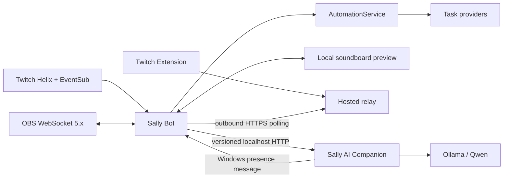
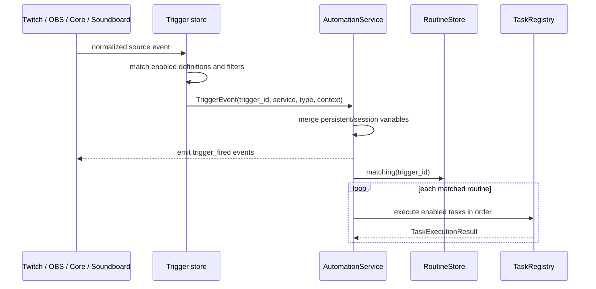
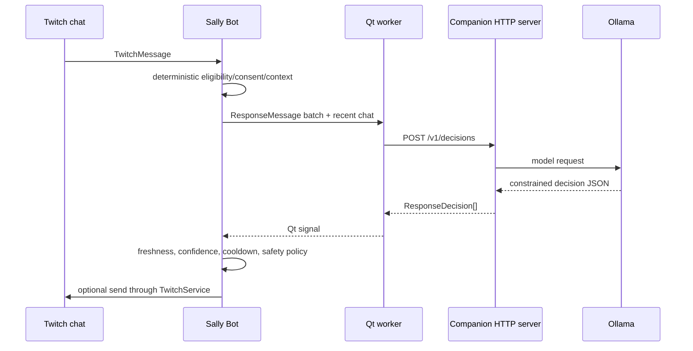
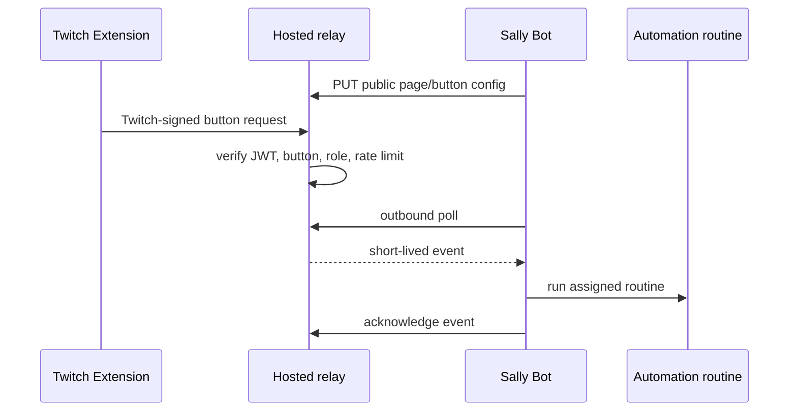

# Sally architecture reference

> Canonical implementation map for maintainers and coding agents.
>
> Last verified: 2026-07-28 against version `0.1.0`, commit `0fb9a54`.
> Update this file when a change moves ownership, adds a persisted format,
> changes an inter-process contract, or introduces a new service/trigger/task.

## How to use this document

Read only the sections relevant to the task:

- Start with **System at a glance** and **Ownership boundaries** for orientation.
- Use **Change-routing guide** to identify the files and tests likely involved.
- Read a subsystem section before changing Twitch, automation, AI, OBS, or the
  soundboard.
- Check **Persistence and secrets** before adding or moving stored data.
- Check **Threading and UI safety** before performing network or model work.
- Check **Build and verification** before handing off an executable.

This file describes the code that exists. The focused documents under `docs/`
provide product behavior and policy detail:

- `docs/twitch-architecture.md`
- `docs/local-ai.md`
- `docs/viewer-memories.md`
- `docs/offline-design-checkpoint-2026-07-20.md`
- `docs/release-checklist.md`

## System at a glance

Sally is a Windows-first Python/PySide6 streaming platform split into two
independent desktop applications and one optional hosted service.

| Process | Entry point | Owns | Must not own |
| --- | --- | --- | --- |
| Sally Bot | `main.py` → `app/app.py` | Twitch, OBS, chat UI, stream companion, commands, automation, queues, variables, soundboard, consent enforcement | Ollama inference or heavyweight AI implementation |
| Sally AI Companion | `companion_main.py` → `sally_companion/app.py` | Ollama provider, reply reasoning, memory extraction, AI settings, training data, AI test reports | Twitch sockets, OBS control, automation execution |
| Soundboard relay | `python -m twitch_extension.relay_server` | Twitch Extension JWT verification, public soundboard config, short-lived viewer requests | Local files, audio playback, routine execution |

Sally Bot works by itself. AI Companion is optional and can be installed,
started, stopped, and upgraded separately. The hosted relay is only required
for the public Twitch Extension; local soundboard preview does not require it.



## Architectural vocabulary

- **Service**: an integration or capability provider, such as Twitch, OBS,
  Core, AI Companion, or Soundboard.
- **Trigger definition**: persisted matching/configuration owned by a service.
- **Trigger event**: one normalized runtime occurrence represented by
  `automation.models.TriggerEvent`.
- **Routine**: an ordered, enabled/disabled workflow that can link one or more
  trigger IDs.
- **Task definition**: persisted configuration for one step in a routine.
- **Task handler/provider**: executable implementation registered for a task
  type in `TaskRegistry`.
- **Queue**: optional serialized execution policy assigned to routines.
- **Event bus event**: in-process notification sent through `core.events.Events`;
  it is not the same thing as a persisted automation trigger.

Use these terms consistently in code and UI. A friendly editor may combine
trigger and routine setup, but their stored records remain separate.

## Repository map

| Path | Responsibility |
| --- | --- |
| `app/` | Sally Bot application startup and shutdown |
| `ai/` | Heavyweight Companion-only Ollama, reasoning, extraction, training, and report implementations |
| `automation/` | Neutral trigger/routine/task/queue models, execution, variables, logic, import/export |
| `config/` | Version, Twitch client/scopes, and Extension constants |
| `core/` | Event bus, logging, settings, paths, atomic JSON, DPAPI secrets, backup, diagnostics, resources |
| `obs_service/` | OBS WebSocket transport, configuration, triggers, and task handlers |
| `sally_companion/` | Companion UI, HTTP server/client, protocol serialization, remote store proxies, presence notifier |
| `sally_shared/` | Dependency-light models and policy shared by Bot and Companion |
| `soundboard/` | Local soundboard models/store/server and hosted relay client |
| `twitch/` | OAuth, Helix, EventSub, normalized Twitch models, commands, event triggers, analytics/history |
| `twitch_extension/` | Extension HTML/CSS/JS, hosted relay server, listing assets |
| `ui/` | Sally Bot Qt shell, dynamic pages, workers, bridges, controllers, generated Designer code |
| `tests/` | Unit, integration-style Qt, persistence, protocol, release, and smoke coverage |
| `scripts/` | Windows builds, release packaging, Extension packaging, smoke tests, simulations |

## Startup, composition, and shutdown

### Sally Bot

`main.py` configures logging and calls `app.app.run()`.

`app/app.py`:

1. Creates `QApplication` and application metadata.
2. Creates separate broadcaster and optional bot `TwitchAuthService` objects.
3. Creates `TwitchService`.
4. Constructs `ui.main_window.MainWindow`, which is the current composition
   root for most Bot services and stores.
5. Shows the window, restores both Twitch identities, fires Core startup, then
   schedules optional OBS and soundboard-relay auto-connect.
6. Runs the Qt event loop.
7. Clears the global event bus and shuts down logging after the window closes.

`MainWindow.__init__` creates or receives injectable instances of:

- Twitch command, EventSub-trigger, Core-trigger, and OBS-trigger stores
- the shared `RoutineStore`
- `CustomVariableStore`
- automation queue store/manager
- OBS service/config
- soundboard store/local server/relay client
- chatter, activity, and stream-session stores
- training/test-report remote proxies
- `TaskRegistry` and `AutomationService`
- release, backup, health, window-state, and settings helpers

The constructor loads recoverable stores independently. A corrupt optional
store should log a warning and fall back to an empty/default state rather than
preventing the application from opening.

Core `application.started` fires after the Qt loop begins. Core
`application.closing` fires before service teardown. Shutdown must stop timers,
unsubscribe event handlers, close Twitch/OBS, stop soundboard threads/servers,
save state, and only then let `app/app.py` clear the event bus.

### AI Companion

`companion_main.py` configures logging and calls `sally_companion.app.run()`.

`CompanionWindow`:

1. Loads `CompanionSettings`.
2. Creates `CompanionReasoningService`.
3. binds a `ThreadingHTTPServer` to `127.0.0.1:8765` by default;
4. starts the server on a daemon thread;
5. sends Sally Bot a Windows registered-message presence notification;
6. builds the Companion UI and periodically refreshes Companion-owned data.

The Companion initiates discovery. Sally Bot does not poll continuously when
the Companion is absent. `WindowsBotPresenceNotifier` finds the window titled
`Sally Bot` and posts protocol version and port. Bot handles the registered
Windows message in `MainWindow.nativeEvent`, then performs HTTP health/ping work
on a worker. A zero port is the disconnect notification.

Do not replace this with a Bot-side retry timer: the explicit goal is zero AI
connection activity while Companion is not running.

## Ownership boundaries

### Sally Bot owns

- Twitch OAuth sessions and API/WebSocket connections
- broadcaster versus bot-account identity selection
- all outgoing Twitch actions and moderation
- OBS connection and actions
- chat rendering, chatters, activity, ads, analytics, channel points
- commands, routines, triggers, tasks, queues, and variable state
- viewer consent, deletion, daily-context policy, and approved viewer records
- soundboard configuration and local routine execution
- deciding whether a draft may actually be sent

### AI Companion owns

- Ollama endpoint/model selection used by inference
- reply decision and memory-extraction implementation
- personality and profanity settings used in prompts
- training-example persistence and review UI
- AI test-report persistence and UI
- bounded in-process decision and extraction history for its dashboard

### Shared code may contain

- serialized request/response models
- deterministic response policy
- viewer-context assembly rules
- protocol version constants
- presence message constants

`sally_shared/` must remain lightweight. It must not import Qt UI, Twitch
transport, OBS, or the `ai/` provider implementation.

### Important current compromise

Sally Bot still contains the AI remote/control pages and coordinates RAM queues,
recent chat, consent, and send policy. Heavy model code lives only in
AI Companion. The Bot PyInstaller command explicitly excludes `ai` and
`sally_companion.server`.

When moving an AI feature, separate:

1. data collection and authorization in Bot;
2. versioned DTOs in `sally_shared/` and `sally_companion/protocol.py`;
3. inference in Companion;
4. enforcement/action in Bot.

## In-process event bus

`core.events.Events` is a process-global synchronous publish/subscribe bus:

- event names are trimmed and lowercased;
- duplicate subscriptions are ignored;
- listener access is protected by `RLock`;
- each listener exception is logged and isolated;
- `emit()` calls subscribers on the emitting thread.

Because callbacks are synchronous, a bus subscriber must not perform slow
network/model work directly. It also must not mutate Qt widgets if the event may
originate on a non-UI thread.

`ui.twitch_bridge.TwitchQtBridge` is the main thread boundary for Twitch:
bus callbacks emit Qt signals, and `MainWindow` slots update widgets on the Qt
thread.

Important event families:

| Family | Producer | Main consumers |
| --- | --- | --- |
| `twitch_auth_changed`, `twitch_bot_auth_changed` | `TwitchAuthService` | Twitch bridge / connection UI |
| `twitch_status_changed` | `TwitchService` | status bar, health, connection UI |
| `twitch_message_received` | `TwitchService` | chat, command dispatcher, AI queue, memories, first-message triggers |
| `twitch_event_received` | `TwitchService` | raw EventSub diagnostics |
| `twitch_event`, `twitch_event.<type>` | `TwitchService` | activity feed, sessions, Twitch automation |
| `obs_status_changed` | `ObsWebSocketService` | connection UI |
| `obs_event`, `obs_event.<type>` | `ObsWebSocketService` | OBS automation and UI state |
| `trigger_fired`, `trigger_fired.<service>.<type>` | `AutomationService` | diagnostics/history/extensions |
| routine/task lifecycle events | `AutomationService` | Automation run history |
| queue lifecycle events | automation service/tasks | queue UI/history |

## Automation architecture

### Canonical models

`automation/models.py` defines:

- `TriggerEvent`
- `TaskDefinition`
- `RoutineGroup`
- `RoutineDefinition`
- `TaskExecutionResult`
- `RoutineExecutionResult`
- `AutomationExecutionResult`

`TriggerEvent.context` is a string-to-string mapping. Service adapters normalize
external payloads before automation sees them. Task templates use
`{lowercase_name}` variables.

A routine stores a primary `trigger_id` plus `additional_trigger_ids`. Trigger
stores own trigger-specific metadata; `RoutineStore` owns task order, routine
groups, enable state, queue assignment, and trigger-ID links.

### Shared routine store

`TwitchCommandTriggerStore` creates the canonical `RoutineStore`. Twitch event,
Core, and OBS trigger stores receive that same object/path. Do not instantiate
an unrelated routine store for a new trigger provider inside `MainWindow`;
doing so would split the automation graph.

Service-managed routines use:

- `RoutineDefinition.managed_by` to identify the owning editor;
- `TaskDefinition.managed_key` to protect the service-managed task.

Service editors must update their managed task in place and preserve user-added
tasks and ordering.

### Trigger-to-task pipeline



`AutomationService`:

- merges global/session values into a fresh context per routine;
- emits normalized lifecycle events;
- runs enabled tasks in order;
- stops on failed tasks or a logic `break`;
- blocks recursive routine loops;
- limits nested routines to ten levels;
- supports manual routine/task tests through the same execution path.

A routine with no enabled/executed tasks is not considered successful.

### Queues

Routines may reference an `AutomationQueueDefinition`. Queue policy supports:

- pause/resume;
- maximum pending length;
- duplicate `allow`, `ignore`, or `replace`;
- delay between completed items.

Pending/current queue items are runtime-only. Queue definitions persist.
`AutomationService.process_queues()` is called periodically on the Qt thread so
Qt-based tasks remain thread-safe.

### Variables

`CustomVariableStore` owns:

- **global** variables: persisted across launches;
- **session** variables: cleared when Sally closes;
- **routine** variables: context-only, shared with nested routines during one
  execution.

The UI hides scope syntax from template users. A variable named `random_line`
is referenced as `{random_line}`. Variable-name fields accept either form and
normalize to the bare internal key.

Generated outputs are discoverable through
`CustomVariableStore.generated_names()`. Add every new output-producing task
there so command validation, editor previews, and template help recognize it.

Variable precedence when preparing a trigger is:

1. persisted/session custom variables;
2. source trigger context (wins on name collision);
3. task-created values as the routine executes.

Built-in names in `automation/variables.py` are reserved from custom creation.

### Task providers

Handlers are registered in `MainWindow` with one stable lowercase task type.

| Provider | Files | Current capability groups |
| --- | --- | --- |
| Core | `automation/core_tasks.py` | applications, delays, service waits, paths/URLs, notifications, audio, Python scripts |
| Variables | `automation/variable_tasks.py` | create/delete/adjust/toggle variables, nested routines |
| Logic | `automation/logic_tasks.py` | break, input, random number/choice, if/else, switch, while |
| Files | `automation/file_tasks.py` | read text/random/specific lines, write, existence, line count |
| Control | `automation/control_tasks.py` | enable/disable routines/tasks, pause/clear queues |
| Twitch | `twitch/tasks.py` | chat/pinned chat, ads, moderation, redemption results |
| OBS | `obs_service/tasks.py` | scenes, sources, inputs, filters, media, outputs, hotkeys, raw request |

Adding a task requires more than a handler. See **Adding an automation task**.

### Trigger providers

| Provider | Store | Persisted file | Examples |
| --- | --- | --- | --- |
| Twitch commands | `TwitchCommandTriggerStore` | `twitch/commands.json` | `!command`, aliases, permissions, cooldowns |
| Twitch activity | `TwitchEventTriggerStore` | `twitch/event_triggers.json` | follow, sub, gift, cheer, raid, reward, online/offline |
| Twitch first message | same as above | same | once per viewer per stream with offline grace reset |
| Core | `CoreTriggerStore` | `automation/core_triggers.json` | application started/closing |
| OBS | `ObsTriggerStore` | `obs/triggers.json` | connection, scene, source, audio, media, output changes |
| Soundboard | button record in `SoundboardStore` | `twitch/soundboard.json` | local preview or Extension button |

The first-message trigger is synthesized from accepted chat messages, not a
native EventSub subscription. It ignores broadcaster/bot messages, tracks
viewer identity per trigger, resets on a new stream ID, and preserves state
through brief offline periods according to `reset_minutes`.

## Twitch subsystem

### Authentication

`twitch/auth.py` implements Twitch public-client Device Code OAuth.
Broadcaster and bot identities use distinct `TwitchAuthService` and encrypted
token files.

The polling loop follows RFC 8628:

- `authorization_pending`: continue at the current interval;
- `slow_down`: add five seconds to all later polls;
- `access_denied`: fail immediately with a visible denial;
- `expired_token`: fail immediately;
- any other HTTP 400 reason: stop and surface it.

`twitch/token_store.py` encrypts tokens with Windows DPAPI. Signing out is the
only normal operation that deletes credentials. API 401 recovery refreshes with
a cooldown against refresh loops.

### Live transport

`twitch/live.py` contains:

- `TwitchHelixClient` for REST resources and actions;
- `TwitchEventSubSocket` for EventSub WebSocket sessions.

`twitch/service.py` coordinates auth, broadcaster channel identity, one or two
EventSub sockets, subscription creation, parsing, and public operations used by
UI/tasks.

With a separate bot identity:

- bot-authorized socket handles chat;
- broadcaster-authorized socket handles channel activity/moderation scopes.

`twitch/catalog.py` is the subscription catalog. `twitch/parser.py` converts
payloads into typed models from `twitch/models.py`.

Accepted chat becomes `TwitchMessage`; non-chat notifications become
`TwitchEvent`. Raw diagnostic records remain separate from the human activity
feed.

### Message handling in MainWindow

An accepted non-bot chat message can feed several independent consumers:

1. Twitch chat rendering;
2. chatter/session counters;
3. custom command dispatch;
4. first-message automation;
5. RAM recent-chat context;
6. AI reply decision queue;
7. opt-in memory buffer/training capture.

Keep these consumers independent. A failure in AI or memory must never prevent
chat display or command automation.

### Simulation

`twitch/eventsub.py` implements signed webhook processing and a local listener
for developer simulation. `twitch/simulator.py` produces test payloads.
Simulation should traverse the same parser, bus, activity, and automation path
as live events whenever possible.

## OBS subsystem

`ObsWebSocketService` implements OBS WebSocket 5.x over Qt WebSockets.

- connection config: `obs_service/config.py`;
- password: separate DPAPI secret;
- normalized models: `obs_service/models.py`;
- trigger matching: `obs_service/triggers.py`;
- automation tasks: `obs_service/tasks.py`.

Connection intent and current socket state are separate:

- startup auto-connect defaults off;
- once connection is requested, auto-reconnect can wait for OBS to open;
- an unexpected OBS close changes status and schedules reconnect;
- an intentional disconnect does not reconnect.

OBS event handlers cache useful live state such as input mute. Task variable
resolution may query live OBS state when a template requests `{muted}` or other
live values; do not assume every value is present in the original trigger.

Qt WebSocket callbacks already arrive in Qt context. Preserve asynchronous
request IDs and callbacks rather than blocking the UI waiting for OBS.

## AI Companion subsystem

### Local HTTP contract

`sally_companion/protocol.py` owns serialization and `PROTOCOL_VERSION`.
`CompanionClient` is synchronous by design and must be used only in worker
threads. Every request includes `X-Sally-Protocol`.

Current routes:

| Route | Purpose |
| --- | --- |
| `POST /v1/ping` | lightweight Bot-contact and protocol check |
| `POST /v1/status` | Ollama availability, installed models, selected model |
| `POST /v1/decisions` | batched reply/ignore/conversation decisions |
| `POST /v1/memories` | constrained memory proposals |
| `POST /v1/settings` | get/set Companion-owned AI settings |
| `POST /v1/training` | capture, label, delete, load, or clear samples |
| `POST /v1/test-report` | record/query/clear AI test outcomes |

The server binds to loopback and has no authentication. Never bind it to
`0.0.0.0` or expose it through port forwarding without adding authentication,
authorization, origin controls, request limits, and threat review.

If a request/response shape changes incompatibly:

1. change DTO conversion in `sally_companion/protocol.py`;
2. update both client and server;
3. increment `PROTOCOL_VERSION`;
4. update protocol and worker tests;
5. retain a clear mismatch error.

### Reasoning flow



`ResponseDecisionWorker`, `MemoryExtractionWorker`, and Companion refresh
workers use `QThreadPool`/`QRunnable` and signals. The Bot owns final policy:
model output does not bypass consent, freshness, rate, or send gates.

Bot recent-chat and extraction buffers are bounded RAM structures. Companion
decision/memory history is also bounded in memory for dashboard display.

### Viewer memory boundary

Viewer consent and deletion are Bot responsibilities. The Companion only
proposes structured memories. A proposal is not an approved memory.

The memory flow is:

1. Bot accepts eligible messages only for opted-in viewers when memory is
   enabled.
2. Bot sends a bounded evidence batch and approved-memory summaries.
3. Companion returns constrained proposals tied to evidence IDs.
4. Bot validates and stores proposals as pending.
5. Streamer review approves, edits, archives, or deletes.

Confirmed viewer deletion must remove live records, activity references,
pending content, and matching records in existing backup archives.

## Soundboard and Twitch Extension

### Local preview

`SoundboardLocalServer` binds to `127.0.0.1` on an available port and serves the
same viewer assets used by the Extension. A random per-process token protects
configuration and trigger endpoints. Accepted buttons emit a Qt signal and run
their assigned routine locally.

### Hosted Extension

The viewer Extension cannot connect directly to a broadcaster's local PC.
The flow is:



Security boundaries:

- Extension viewer assets contain only the relay URL, never secrets.
- Relay verifies Twitch JWTs with `TWITCH_EXTENSION_SECRET`.
- Bot authenticates using channel ID plus a DPAPI-protected relay key.
- Public relay config contains page/button IDs and labels, not local file paths
  or routine internals.
- Pending events expire after five minutes and are removed on acknowledgement.
- Bot only makes outbound HTTPS requests; no router port forwarding is needed.

`render.yaml` describes the current Render deployment. Render's free filesystem
is temporary, so Bot re-syncs config when reconnecting.

## UI architecture

### Sally Bot shell

Primary left navigation:

- Dashboard
- Your Channel
- AI
- Automation
- Connections
- Logs
- Settings

Your Channel top tabs:

- Chat
- Analytics
- Soundboard
- Commands
- Channel Points

AI in Bot is a remote/control workspace. Companion has its own left navigation:

- Dashboard
- Memories
- Reply Review
- Training
- Test Report
- Personality
- Settings

Automation has Routines, Queues, Task Library, and Run History. The selected
routine editor contains Triggers, Tasks, Settings, and History.

### Designer versus dynamic UI

- `ui/mainwindow.ui` is the Qt Designer source.
- `ui/generated/ui_mainwindow.py` is generated output; do not hand-edit it.
- `ui/main_window.py` replaces/builds substantial dynamic areas after
  `setupUi()`.
- large feature widgets live in focused modules such as
  `ui/automation_page.py`, `ui/soundboard_page.py`, and
  `ui/channel_points_page.py`.

Prefer a focused widget/module for new substantial pages. `MainWindow` is
already a large composition/orchestration class; avoid putting reusable domain
logic or network protocol code in it.

### Responsive layout

`ui/responsive.py` is shared by Bot and Companion.

- automatic breakpoint: width/height ratio `1.75`;
- five-percent hysteresis prevents resize flicker;
- manual landscape and portrait overrides are persisted;
- portrait uses top navigation and rearranges splitters/panels;
- adjustable splitter and table-column state should remain user-controlled.

New pages must remain usable in both orientations and should use scroll areas
when controls would otherwise be crushed.

## Threading and UI safety

Use these rules:

1. Qt widgets are mutated only on the Qt/main thread.
2. Slow Helix, localhost HTTP, filesystem batches, and model work run in
   workers or dedicated service threads.
3. Worker results return through Qt signals.
4. The global event bus is synchronous and does not switch threads.
5. `ThreadingHTTPServer` request handlers must not touch Qt widgets directly.
6. Soundboard server and relay threads communicate through Qt signals.
7. Automation execution currently occurs on the Qt thread because several task
   handlers use Qt APIs; do not move it wholesale to a Python thread without
   separating Qt-dependent handlers.
8. Avoid blocking waits. Core delay tasks use a nested Qt event loop so the UI
   continues processing events.

## Persistence and secrets

`core.paths.user_data_root()` resolves:

1. `SALLY_DATA_DIR` when set (tests/smoke isolation);
2. `%LOCALAPPDATA%\SallyAI`;
3. a temporary-directory fallback if app data is unwritable.

JSON stores use `atomic_write_json()` and `load_json_with_backup()`: write to a
temporary file, keep an adjacent `.bak`, then replace atomically.

### Main files

| Relative path | Owner | Notes |
| --- | --- | --- |
| `config/settings.json` | Bot | `AppSettings`, validated/defaulted |
| `companion/settings.json` | Companion | model, endpoint, personality/language |
| `automation/routines.json` | Bot | groups, routines, ordered tasks, trigger links |
| `automation/core_triggers.json` | Bot | application lifecycle bindings |
| `automation/queues.json` | Bot | queue definitions; pending items are not persisted |
| `automation/variables.json` | Bot | global values only; session/routine are volatile |
| `twitch/commands.json` | Bot | commands, permissions, aliases, cooldowns, stats |
| `twitch/event_triggers.json` | Bot | Twitch event/first-message trigger definitions |
| `twitch/soundboard.json` | Bot | pages, buttons, routine IDs |
| `twitch/soundboard-relay.json` | Bot | non-secret relay URL/channel/autoconnect |
| `obs/connection.json` | Bot | non-secret OBS host/port/autoconnect |
| `obs/triggers.json` | Bot | OBS trigger definitions |
| `memory/twitch_chatters.json` | Bot | consent-aware profiles, roles, timelines, memories |
| `memory/twitch_activity.json` | Bot | bounded activity feed history |
| `memory/stream_sessions.json` | Bot | active/completed session analytics |
| `training/examples.json` | Companion | consent-based classifier examples |
| `diagnostics/ai_test_report.json` | Companion | AI outcomes/latency metadata |
| `logs/` | each process | rotating application logs |
| `backups/` | Bot | allowlisted local data archives |

Window geometry/state uses Qt `QSettings`, not the JSON stores.

### Secret files

| File | Secret |
| --- | --- |
| `twitch-token.dat` | broadcaster Twitch tokens |
| `twitch-bot-token.dat` | optional bot Twitch tokens |
| `obs/password.dat` | OBS WebSocket password |
| `twitch/soundboard-relay-key.dat` | private relay key |

Secrets use Windows DPAPI through `core.secret_store`/token stores. Never place
them in JSON, backups, diagnostics, logs, test fixtures containing real values,
Extension assets, or Git.

### Backup caveat

`BackupManager.FILES` is an explicit allowlist. A new persistent file is not
automatically backed up. Decide deliberately whether it belongs in backups,
legacy migration, restore, diagnostics, and viewer-deletion scrubbing.

At this snapshot, the backup allowlist covers core settings, primary Twitch
history/commands/triggers/routines, Core triggers, and OBS config/triggers. It
does not automatically include every newer queue, variable, soundboard,
Companion, training, or test-report file. Treat that as an explicit product
decision or follow-up when changing data safety.

## Security and privacy invariants

- Local Companion and preview servers bind only to `127.0.0.1`.
- Hosted relay traffic must use HTTPS except explicit localhost development.
- OAuth, OBS, relay, and Extension secrets are never logged.
- Chat content is intentionally absent from ordinary application logs.
- General raw chat history is not persisted.
- AI memory is opt-in and master-disabled by default.
- Training capture is separately opt-in and disabled by default.
- Model output cannot directly approve memories or bypass Bot send policy.
- Broadcaster and bot identities remain separate.
- Viewer deletion includes backup scrubbing where covered.
- Diagnostic export includes sanitized warnings and non-secret health/settings.
- External payloads and imported routines are bounded and validated.
- Python-script tasks are explicitly trusted local code and run out of process.

## Build and verification

### Development

```powershell
python -m venv .venv
.\.venv\Scripts\python.exe -m pip install -r requirements.txt
.\.venv\Scripts\python.exe main.py
.\.venv\Scripts\python.exe companion_main.py
```

Runtime dependency is currently pinned to PySide6. PyInstaller is a separate
build dependency.

### Tests

Preferred full suite:

```powershell
.\.venv\Scripts\python.exe -m pytest -q
```

Tests use dependency injection, temporary stores, `SALLY_DATA_DIR`, mocked
network clients, and offscreen Qt. Add focused tests beside the subsystem and
run the full suite before packaging.

### Windows bundles

```powershell
.\scripts\build_windows.ps1
.\scripts\smoke_test_packaged.ps1
```

Outputs:

- `dist\SallyBot\SallyBot.exe`
- `dist\SallyAICompanion\SallyAICompanion.exe`

The build includes Qt's offscreen platform DLL so packaged smoke tests can run
without displaying windows. `SALLY_SMOKE_TEST=1` schedules a clean automatic
exit.

Release archives and checksums:

```powershell
.\scripts\package_release.ps1
```

The script produces independent Bot and Companion ZIPs. Do not merge them:
Bot-only users should not download the model/AI application.

### Twitch Extension bundle

```powershell
.\scripts\build_twitch_extension.ps1 -RelayUrl https://relay.example.com
```

The output contains public assets only. Never include the Twitch Extension
secret or broadcaster relay key.

## Change-routing guide

### Adding an automation task

Inspect and update:

1. handler in the correct provider module;
2. provider label/type catalog;
3. registration in `MainWindow`;
4. schema and task menu in `ui/automation_page.py`;
5. template rendering and live-variable resolution if applicable;
6. `CustomVariableStore.generated_names()` if it creates outputs;
7. import/export validation in `automation/transfer.py` if needed;
8. focused execution, editor, and integration tests.

Never add a UI menu item without a registered handler, or a handler without an
editor schema unless it is intentionally internal.

### Adding an automation trigger

Inspect and update:

1. service trigger catalog/dataclass/store;
2. normalized `TriggerEvent` context;
3. UI menu/editor;
4. event wiring in `MainWindow`;
5. import/export mapping;
6. live and simulated paths;
7. persistence-version migration and tests.

Link the existing shared `RoutineStore`.

### Changing Twitch

Route by concern:

- OAuth/scopes: `config/twitch.py`, `twitch/auth.py`, `twitch/token_store.py`
- EventSub catalog/socket: `twitch/catalog.py`, `twitch/live.py`
- parsing/models: `twitch/parser.py`, `twitch/models.py`
- orchestration/actions: `twitch/service.py`
- commands: `twitch/commands.py`, `ui/twitch_command_dialog.py`
- activity automation: `twitch/automation_triggers.py`
- UI consumption: `ui/twitch_bridge.py`, `ui/main_window.py`
- health/scopes: `twitch/health.py`

Verify both broadcaster-only and separate-bot configurations.

### Changing AI or memory

Ask which side owns the change:

- deterministic eligibility/consent/send policy: Bot/shared;
- DTO or protocol: shared + client + server, possibly version bump;
- prompt/provider/extraction: Companion `ai/`;
- UI-only AI controls: Bot remote page or Companion page, depending ownership;
- persistent AI data: Companion store plus remote proxy if Bot displays it.

Test Companion absent, Companion present, protocol mismatch, timeout, stale
result, and explicit memory disable.

### Changing persistence

For each persisted schema:

1. increment the store version only when required;
2. accept older versions and migrate without changing stable IDs;
3. reject newer unknown versions;
4. write atomically;
5. use a temporary path in tests;
6. decide backup, migration, diagnostics, deletion, and secret handling;
7. add corrupt/round-trip/migration tests.

### Changing UI

- edit `ui/mainwindow.ui` then regenerate `ui/generated/ui_mainwindow.py` for
  Designer-owned controls;
- use focused widgets for substantial dynamic features;
- test both portrait and landscape;
- preserve adjustable splitter/table state;
- use Qt signals to cross worker threads;
- avoid launching a visible application during unattended/headless work.

### Changing the Companion API

Update protocol DTOs, server route, client call, worker, both UIs, protocol
tests, and packaged builds. Increment `PROTOCOL_VERSION` for incompatible
changes.

### Changing the soundboard

Inspect:

- `soundboard/models.py` and `soundboard/store.py`
- `ui/soundboard_page.py`
- `soundboard/server.py` local preview
- `soundboard/relay.py` Bot outbound client
- `twitch_extension/viewer.*`
- `twitch_extension/relay_server.py`
- `scripts/build_twitch_extension.ps1`

Keep public config free of local paths and routine internals.

## Known constraints and architectural debt

- `ui/main_window.py` remains a very large composition root and coordinator.
  New reusable domain logic should move into services/stores rather than making
  it larger.
- The event bus is global and synchronous. It is simple but has no typed schema,
  replay, priority, or async scheduling.
- Automation tasks run in the UI process, and some intentionally use Qt APIs.
  A future background executor needs explicit task affinity.
- Trigger providers use separate persisted stores linked by IDs. Cross-file
  updates are validated but are not transactional across multiple files.
- Companion HTTP has no authentication because it is loopback-only.
- The hosted relay uses SQLite and in-memory rate-limit state; horizontal
  scaling would need shared storage and stronger operational controls.
- Backup coverage is allowlist-based and currently lags some newer data stores.
- UI layout is partly Designer-generated and partly dynamic, making structural
  changes span multiple files.
- Version remains `0.1.0`; persisted store versions and Companion protocol
  version are independent of the product version.

## Non-goals and future extension points

Near-term architecture should preserve:

- model-agnostic Companion provider boundary;
- service-owned trigger providers;
- registry-based task providers;
- versioned localhost protocol;
- separate lightweight Bot and optional Companion packages;
- local-first privacy and explicit viewer consent.

Future Voice, Vision, avatar, timers, and plugins should enter as services that
publish normalized triggers and/or register tasks. They should not add direct
special-case calls between unrelated UI pages.

Plugins remain a late-stage capability. Stable service, trigger, routine, task,
protocol, security, and migration contracts should exist before exposing them
to third-party code.
