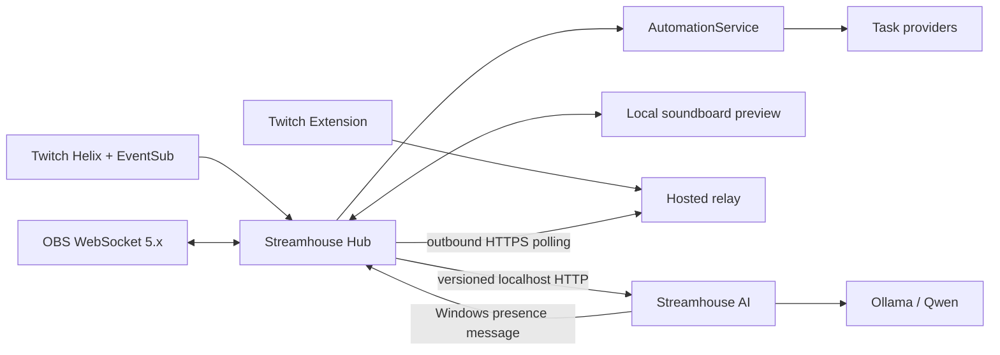
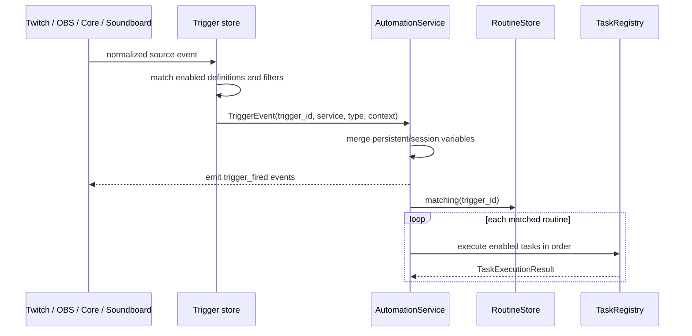
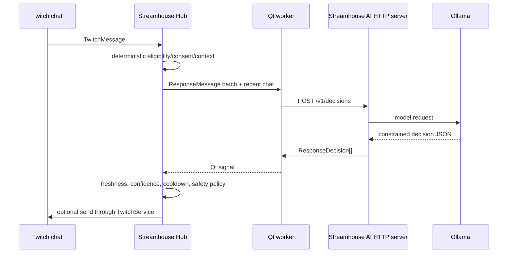
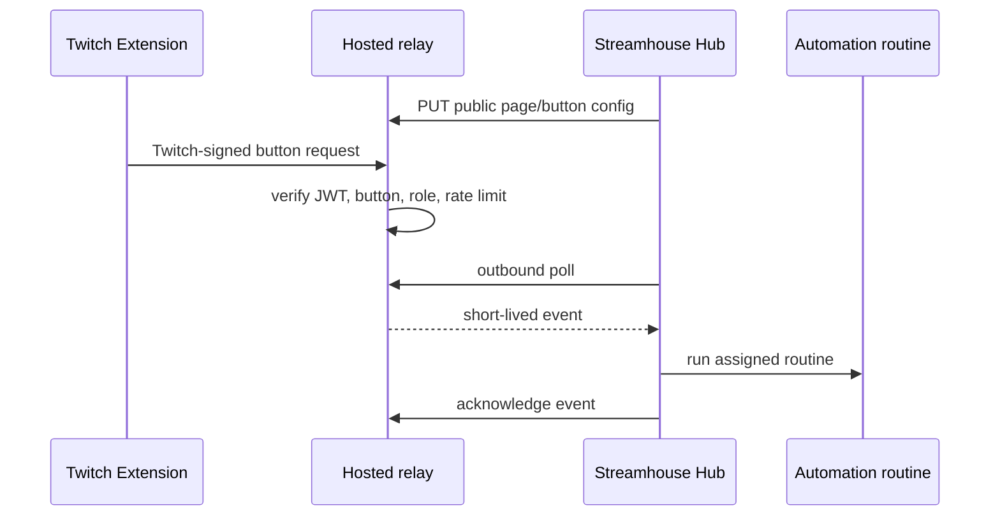

# Streamhouse implementation architecture reference

> Canonical implementation map for maintainers and coding agents.
>
> Last verified: 2026-08-31 against version `0.1.0`.
> Update this file when a change moves ownership, adds a persisted format,
> changes an inter-process contract, or introduces a new service/trigger/task.

## How to use this document

Read only the sections relevant to the task:

- Start with **System at a glance** and **Ownership boundaries** for orientation.
- Use **Change-routing guide** to identify the files and tests likely involved.
- Read a subsystem section before changing Twitch, automation, AI, OBS, or the
  soundboard.
- Check **Persistence and secrets** before adding or moving stored data.
- Check **Threading and UI safety** before performing network or model work.
- Check **Build and verification** before handing off an executable.

This file describes the code that exists. The focused documents under `docs/`
provide product behavior and policy detail:

- `docs/architecture/development-policy.md` (authoritative pre-alpha engineering
  and compatibility rules)
- `docs/architecture/product-family.md` (canonical product-facing names)
- `docs/hub/twitch.md`
- `docs/ai/local-ai.md`
- `docs/shared/viewer-memories.md`
- `docs/architecture/offline-design-checkpoint-2026-07-20.md`
- `docs/architecture/release-checklist.md`

Product-facing branding is defined in the
[Streamhouse product-family reference](product-family.md). This implementation
map uses the current code, executable, protocol, window-title, and storage
identifiers.

Streamhouse has not reached its first external Alpha. A transitional path
described in this implementation map is not automatically an Alpha support
requirement; apply `development-policy.md` when deciding whether to migrate or
remove it.

## System at a glance

The repository currently contains two independent Windows-first Python/PySide6
desktop applications and one optional hosted service.

| Product and current process | Entry point | Owns | Must not own |
| --- | --- | --- | --- |
| Streamhouse Hub | `products/hub/hub_main.py` -> `products/hub/streamhouse_hub/app.py` | Twitch, OBS, structured chat UI, moderation, commands, automation, counters, queues, variables, soundboard, consent enforcement | Ollama inference or heavyweight AI implementation |
| Streamhouse AI | `products/ai/ai_main.py` -> `products/ai/streamhouse_ai/app.py` | Ollama provider, reply reasoning, memory extraction, AI settings, training data, AI test reports | Twitch sockets, OBS control, automation execution |
| Soundboard relay | `python -m extensions.twitch.app.relay_server` | Twitch Extension JWT verification, public soundboard config, short-lived viewer requests | Local files, audio playback, routine execution |

Streamhouse Hub works by itself. Streamhouse AI is optional and can be
installed, started, stopped, and upgraded separately. The hosted relay is only
required for the public Twitch Extension; local soundboard preview does not
require it. Streamhouse Studio, Streamhouse Deck, and Streamhouse Avatar are
future products and have no implemented application, entry point, or package in
this repository.



## Architectural vocabulary

- **Service**: an integration or capability provider, such as Twitch, OBS,
  Core, Streamhouse AI, or Soundboard.
- **Trigger definition**: persisted matching/configuration owned by a service.
- **Trigger event**: one normalized runtime occurrence represented by
  `automation.models.TriggerEvent`.
- **Routine**: an ordered, enabled/disabled workflow that can link one or more
  trigger IDs.
- **Task definition**: persisted configuration for one step in a routine.
- **Task provider**: executable handler implementation registered for a task
  type in `TaskRegistry`.
- **Queue**: serialized execution policy assigned to every routine. The
  system-owned Default Queue is used when no custom queue is selected.
- **Event bus event**: in-process notification sent through `core.events.Events`;
  it is not the same thing as a persisted automation trigger.

Use these terms consistently in code and UI. A friendly editor may combine
trigger and routine setup, but their stored records remain separate.

## Repository map

| Path | Responsibility |
| --- | --- |
| `products/hub/streamhouse_hub/` | Streamhouse Hub startup and shutdown |
| `products/hub/automation/` | Hub trigger/routine/task/queue execution, variables, logic, import/export |
| `products/hub/config/` | Hub Twitch client/scopes and Extension constants |
| `products/hub/core/` | Hub event bus, settings, DPAPI secrets, backup, diagnostics, and resources |
| `products/hub/obs_service/` | OBS WebSocket transport, configuration, triggers, and task handlers |
| `products/hub/soundboard/` | Local soundboard models/store/server and hosted relay client |
| `products/hub/twitch/` | OAuth, Helix, EventSub, normalized Twitch models, commands, triggers, analytics/history |
| `products/hub/ui/` | Hub Qt shell, pages, workers, bridges, controllers, and generated Designer code |
| `products/hub/tests/` | Hub-specific unit and Qt integration coverage |
| `products/ai/streamhouse_ai/` | Streamhouse AI UI, localhost server, settings, and Windows presence notifier |
| `products/ai/engine/` | Heavy AI-only Ollama, reasoning, extraction, training, and report implementations |
| `products/ai/tests/` | AI-specific behavior and service coverage |
| `shared/streamhouse_shared/` | Dependency-light protocol, presence, policy, and value contracts |
| `shared/streamhouse_runtime/` | Small cross-product paths, logging, JSON, QSettings, and version utilities |
| `shared/streamhouse_ui/` | Reusable PySide6 window chrome and cross-product UI components |
| `shared/tests/` | Shared runtime and contract tests |
| `extensions/twitch/app/` | Extension HTML/CSS/JS, hosted relay server, listing assets |
| `extensions/twitch/tools/` | Twitch Extension asset and listing builders |
| `tests/integration/` | Hub-AI protocol, presence, data-root, and boundary integration tests |
| `tests/release/` | Build metadata, release tooling, and package-boundary tests |
| `tools/` | Windows builds, release packaging, smoke tests, and development utilities |

The repository uses fully qualified namespace imports from its root, for
example `products.hub.twitch`, `products.ai.engine`, and
`shared.streamhouse_shared`. The suggested extra `src/` nesting was deliberately
omitted: these explicit namespaces already provide unambiguous ownership and
work for module entry points, pytest, and PyInstaller without runtime
`sys.path` manipulation or import fallbacks.

Dependency direction is enforced by ownership and package audits:

- Hub may import `shared.*`, but never `products.ai.engine` or the AI server.
- AI may import `shared.*`, but never `products.hub`.
- Shared code imports neither product.
- Shared Qt presentation components live in `shared/streamhouse_ui/`. Hub uses
  the native Windows frame (including native snap/maximize); AI uses the shared
  frameless title bar. Navigation, pages and window-state persistence remain
  product-owned.
- The lightweight Hub AI client and remote-store adapters live in
  `products/hub/streamhouse_hub/`; the protocol DTOs live in
  `shared/streamhouse_shared/`.

## Startup, composition, and shutdown

### Streamhouse Hub

`products/hub/hub_main.py` configures logging and calls
`products.hub.streamhouse_hub.app.run()`.

`products/hub/streamhouse_hub/app.py`:

1. Creates `QApplication` and application metadata.
2. Creates separate broadcaster and optional bot `TwitchAuthService` objects.
3. Creates `TwitchService`.
4. Constructs `products.hub.ui.main_window.MainWindow`, the current composition
   root for most Hub services and stores.
5. Shows the window, restores both Twitch identities, fires Core startup, then
   schedules optional OBS and soundboard-relay auto-connect.
6. Runs the Qt event loop.
7. Clears the global event bus and shuts down logging after the window closes.

`MainWindow.__init__` creates or receives injectable instances of:

- Twitch command, EventSub-trigger, Core-trigger, and OBS-trigger stores
- the shared `RoutineStore`
- `CustomVariableStore`
- automation queue store/manager
- OBS service/config
- soundboard store/local server/relay client
- chatter, activity, and stream-session stores
- training/test-report remote proxies
- `TaskRegistry` and `AutomationService`
- release, backup, health, window-state, and settings helpers

The constructor loads recoverable stores independently. A corrupt optional
store should log a warning and fall back to an empty/default state rather than
preventing the application from opening.

Core `application.started` fires after the Qt loop begins. Core
`application.closing` fires before service teardown. Shutdown must stop timers,
unsubscribe event handlers, close Twitch/OBS, stop soundboard threads/servers,
save state, and only then let `products/hub/streamhouse_hub/app.py` clear the event bus.

### Streamhouse AI

`products/ai/ai_main.py` configures logging and calls
`products.ai.streamhouse_ai.app.run()`.

`StreamhouseAIWindow`:

1. Loads `StreamhouseAISettings`.
2. Creates `StreamhouseAIService`.
3. binds a `ThreadingHTTPServer` to `127.0.0.1:8765` by default;
4. starts the server on a daemon thread;
5. sends Streamhouse Hub a Windows registered-message presence notification;
6. builds the Streamhouse AI UI and periodically refreshes AI-owned data.

Streamhouse AI initiates discovery. Streamhouse Hub does not poll continuously
when AI is absent. `WindowsHubPresenceNotifier` finds the window titled
`Streamhouse Hub` and posts protocol version and port. Hub handles the registered
Windows message in `MainWindow.nativeEvent`, then performs HTTP health/ping work
on a worker. A zero port is the disconnect notification.

Hub owns one `AIConnectionLifecycle` shared by its AI workers and remote-store
facades. It starts `DISCONNECTED`; a valid presence message moves it to
`VERIFYING`, and only a successful health and protocol check moves it to
`READY`. Only `READY` permits Streamhouse AI requests. Disconnect notifications and
localhost transport failures increment the lifecycle generation, clear queued
AI work, and make in-flight results stale. Hub waits for another presence
announcement instead of retrying a saved endpoint.

Do not replace this with a Hub-side retry timer: the explicit goal is zero AI
connection activity while Streamhouse AI is not running.

Twitch token maintenance is separate from authentication state transitions.
Routine validation or refresh updates the stored token and emits a token event,
but does not emit another signed-in transition or restart chat/EventSub.

## Ownership boundaries

### Streamhouse Hub owns

- Twitch OAuth sessions and API/WebSocket connections
- broadcaster versus bot-account identity selection
- all outgoing Twitch actions and moderation
- OBS connection and actions
- chat rendering, chatters, activity, ads, analytics, channel points
- commands, routines, triggers, tasks, queues, and variable state
- viewer consent, deletion, daily-context policy, and approved viewer records
- soundboard configuration and local routine execution
- deciding whether a draft may actually be sent

### Streamhouse AI owns

- Ollama endpoint/model selection used by inference
- reply decision and memory-extraction implementation
- personality and profanity settings used in prompts
- training-example persistence and review UI
- AI test-report persistence and UI
- bounded in-process decision and extraction history for its dashboard

### Shared code may contain

- serialized request/response models
- deterministic response policy
- viewer-context assembly rules
- protocol version constants
- presence message constants

`shared/streamhouse_shared/` must remain lightweight. It must not import Qt UI,
Twitch transport, OBS, or `products/ai/engine/`.

`shared/streamhouse_runtime/` contains infrastructure that both executable
entry points require before product composition: data-root selection, logging,
atomic JSON helpers, QSettings creation, and the release version. It must not
import either product package.

### Important current compromise

Streamhouse Hub contains the AI remote/control pages
and coordinates RAM queues, recent chat, consent, and send policy. Heavy model
code lives only in Streamhouse AI. The Hub
PyInstaller command explicitly excludes `products.ai.engine` and
`products.ai.streamhouse_ai`.

When moving an AI feature, separate:

1. data collection and authorization in Hub;
2. versioned DTOs in `shared/streamhouse_shared/protocol.py`;
3. inference in Streamhouse AI;
4. enforcement/action in Hub.

## In-process event bus

`core.events.Events` is a process-global synchronous publish/subscribe bus:

- event names are trimmed and lowercased;
- duplicate subscriptions are ignored;
- listener access is protected by `RLock`;
- each listener exception is logged and isolated;
- `emit()` calls subscribers on the emitting thread.

`Events.emit()` invokes every subscriber synchronously on the **emitting
thread**. The bus does not switch to Qt's UI thread. Handlers should therefore
remain fast, and isolating/logging one subscriber's exception does not make
cross-thread widget access safe.

A raw bus subscriber may mutate a Qt widget only when its event is guaranteed
to originate on the Qt UI thread. Any event that may originate from Twitch,
OBS, soundboard, HTTP, AI, filesystem, subprocess, or another worker must cross
an owning subsystem bridge or queued Qt Signal/Slot boundary first:

```text
background/domain event
        -> subsystem Qt bridge or queued signal
        -> Qt UI-thread slot
        -> widget mutation
```

`ui.twitch_bridge.TwitchEventBridge` is the Twitch-specific implementation of
that boundary. It is not a universal bridge for OBS, soundboard, AI, or future
services; each subsystem must use its own Qt-safe result path.

Important event families:

| Family | Producer | Main consumers |
| --- | --- | --- |
| `twitch_auth_changed`, `twitch_bot_auth_changed` | `TwitchAuthService` | Twitch bridge / connection UI |
| `twitch_status_changed` | `TwitchService` | status bar, health, connection UI |
| `twitch_message_received` | `TwitchService` | chat, command and Keyword/Phrase dispatchers, AI queue, memories, first-message triggers |
| `twitch_event_received` | `TwitchService` | raw EventSub diagnostics |
| `twitch_event`, `twitch_event.<type>` | `TwitchService` | activity feed, sessions, Twitch automation |
| `obs_status_changed` | `ObsWebSocketService` | connection UI |
| `obs_event`, `obs_event.<type>` | `ObsWebSocketService` | OBS automation and UI state |
| `trigger_fired`, `trigger_fired.<service>.<type>` | `AutomationService` | diagnostics/history/extensions |
| routine/task lifecycle events | `AutomationService` | Automation run history |
| queue lifecycle events | automation service/tasks | queue UI/history |

## Automation architecture

### Canonical models

`products/hub/automation/models.py` defines:

- `TriggerEvent`
- `TaskDefinition`
- `RoutineGroup`
- `RoutineDefinition`
- `TaskExecutionResult`
- `RoutineExecutionResult`
- `AutomationExecutionResult`

`TriggerEvent.context` is a string-to-string internal mapping. Service adapters
normalize external payloads before automation sees them. User-facing templates
accept only canonical dotted placeholders registered through the modern
Variables architecture, such as `{user.display_name}`, `{command.data}`, or
`{automation.random_line}`.

A routine stores a primary `trigger_id` plus `additional_trigger_ids`. Trigger
stores own trigger-specific metadata; `RoutineStore` owns task order, routine
groups, enable state, queue assignment, and trigger-ID links.

### Shared routine store

`TwitchCommandTriggerStore` creates the canonical `RoutineStore`. Twitch event
(including Hub-derived Ads and chat triggers), Core, and OBS trigger stores
receive that same object/path. Do not instantiate
an unrelated routine store for a new trigger provider inside `MainWindow`;
doing so would split the automation graph.

Service-managed routines use:

- `RoutineDefinition.managed_by` to identify the owning editor;
- `TaskDefinition.managed_key` to protect the service-managed task.

Service editors must update their managed task in place and preserve user-added
tasks and ordering.

### Trigger-to-task pipeline



`AutomationService`:

- merges global/session values into a fresh context per routine;
- refreshes registry-backed values before each task so a later task observes
  domain changes made by an earlier task;
- emits normalized lifecycle events;
- runs enabled tasks in order;
- stops on failed tasks or a logic `break`;
- distinguishes cooperative user cancellation from task failure and success;
- blocks recursive routine loops;
- limits nested routines to ten levels;
- supports manual routine/task tests through the same execution path.

A routine with no enabled/executed tasks is not considered successful.

`TaskRegistry` owns typed `TaskMetadata` for every visible built-in task as well
as its executable handler. Metadata supplies the user-facing label, concise and
detailed help, input guidance, Variable-capable fields, requirements, notes,
examples, and category. The Automation **Task Library** renders and searches
that metadata as a compact built-in reference. Input formats, choices, and
bounds come from the existing task-editor schema. Output-capable tasks derive
their exact placeholders from the typed output-definition architecture rather
than a second output catalog. Internal or test-only handlers may omit visible
metadata, while registry coverage tests prevent user-facing built-ins from
shipping without descriptions and help text. Registration rejects visible task
metadata unless both `short_description` and `help_text` are non-empty; hidden
internal/test task metadata is the only exception. Adding a user-facing task
therefore includes its Task Library documentation as part of defining the task,
not as an optional follow-up.

Counter tasks use this same pipeline. A command, EventSub subscription, OBS
event, Core event, or manual routine execution can invoke any routine that
contains a registered Counter task. Counters do not own a parallel trigger
engine or call Twitch directly.

### Queues

Every routine references an `AutomationQueueDefinition`. The system-owned
**Default Queue** has the stable ID `streamhouse.default.queue`, is created and
persisted automatically, cannot be renamed or deleted, and uses the same queue
manager as every custom queue. New, imported, command-managed, Keyword/Phrase,
Ads, and other trigger routines select it automatically unless the user chooses
a custom queue. The routine editor therefore presents Default Queue as the
beginner default rather than offering a direct-execution/no-queue mode.

Queue policy supports:

- pause/resume;
- stopping the current routine while preserving later pending items;
- stopping a queue by cancelling its current routine and clearing its pending items;
- maximum pending length;
- duplicate `allow`, `ignore`, or `replace`;
- delay between completed items.

Pending/current queue items are runtime-only. Queue definitions persist.
Deleting a custom queue reassigns its routines to Default Queue; loading an
empty or dangling pre-alpha assignment normalizes it to the same stable ID.
Submission and claiming are one thread-safe operation so Qt-triggered routines
and network-backed Chat Command workers preserve one-at-a-time queue behavior.
Nested routines remain part of their parent execution and do not enqueue a
second item. Each claimed root item owns one runtime-only cooperative
cancellation token shared by its nested routines and active cancellable task.
Cancellation never crosses queue boundaries. **Stop Current Routine** cancels
that execution chain and leaves later items queued; **Stop Queue** also removes
all waiting items. Completed side effects are not rolled back, and cleared
items that never started do not create run-history entries. Cancelled routines
are recorded as **Cancelled**, not completed or internally failed.
`AutomationService.process_queues()` is called periodically on the Qt thread so
Qt-based tasks remain thread-safe.

Core **Timer** is an ordinary Automation trigger. One Qt-owned scheduler tracks
all enabled timer definitions without sleeps or a thread per timer. Fixed mode
starts a fresh configured interval after each firing. Random mode samples a new
delay within the configured range after every firing. Seconds, minutes, hours,
and positive decimal values are supported. Each firing publishes through
`AutomationService`, so the routine's configured queue—including Default Queue
fallback—owns ordering, duplicates, accumulation, cancellation, and history.
Editing, disabling, re-enabling, or deleting a trigger replaces or cancels its
runtime schedule; shutdown cancels every timer. Only configuration persists:
Hub startup begins fresh intervals, does not catch up downtime, and never emits
a burst of missed runs.

Run History is a bounded, runtime-only view of executions that actually
started; merely accepting an item into a queue does not create a completed-run
entry. `RoutineExecutionResult` retains root timing, queue/trigger metadata,
ordered task results, and nested routine results for the details window. It
also captures a small allowlisted snapshot of meaningful dotted trigger
context and `automation.*` outputs at execution time. Credential-like names
and unrelated global registry state are excluded. The details window reads
only that snapshot—it must never substitute current live Variable values for
historical ones. Run History is not persisted across Hub restarts.

### Variables

`CustomVariableStore` owns:

- **global** variables: persisted across launches;
- **session** variables: cleared when Streamhouse Hub closes;
- **routine** variables: context-only, shared with nested routines during one
  execution.

`products/hub/automation/variable_registry.py` is the authoritative metadata,
resolution, placeholder, alias, and write-routing layer for modern Hub
variables. Canonical names use `namespace.name` or deeper dotted scopes such as
`counter.<stable_id>.viewer`. `VariableDefinition` records the canonical name,
display name, description, type, source, category, availability, required
context keys, a provider-owned human-readable context label, optional default
and preview values, alias status, and whether the owning provider supports
writes. Valid types are `text`, `integer`, `number`,
`boolean`, and ISO-8601 `datetime`. Providers are registered by `MainWindow`;
malformed names, duplicate names, provider collisions, alias collisions, and
alias loops are rejected. Reserved built-in namespaces currently include
`stream`, `user`, `chat`, `command`, `keyword`, `event`, `counter`, `obs`,
`hub`, `custom`, `automation`, `ads`, `channel_points`, `soundboard`, `target`,
`channel`, `socials`, and `serverinfo`.
Current providers expose:

- cached Twitch stream values: `stream.title`, `stream.category`,
  `stream.viewer_count`, and `stream.game_id`;
- contextual `user.*` and `chat.*` values from the current trigger;
- contextual Chat Command values `command.name`, `command.data`,
  `command.target`, and `command.uses`, where data is the trimmed raw text
  following the recognized command;
- contextual Keyword/Phrase values `keyword.message`, `keyword.match`,
  `keyword.before`, and `keyword.after`;
- cached and calculated Twitch ad state as `ads.*`, plus contextual
  `ads.requester.*` values when an Ads Started event supplies them;
- contextual Channel Point Redemption data as `channel_points.*`, including
  stable reward/redemption IDs, title, cost, prompt, optional viewer input,
  status, and redemption time;
- automatically available Hub-owned Channel Information as `channel.schedule`,
  `channel.rules`, `socials.<service>`, and `serverinfo.details`;
- stable shared counter totals as `counter.<counter_id>.stream` and contextual
  lifetime viewer totals as `counter.<counter_id>.viewer`;
- the observed OBS program scene as `obs.current_scene`;
- Hub uptime and Twitch/OBS connection booleans as `hub.*`;
- persisted/session custom values as `custom.<name>`.

Availability/lifetime is metadata, not a sample-value inference:

- **Global** definitions may resolve whenever their provider has valid state.
  A provider can still report one unavailable while disconnected or before a
  cached value has been observed.
- **Contextual** definitions require trigger/event data. `user.*`, `chat.*`,
  `command.*`, `keyword.*`, `ads.requester.*`, `channel_points.*`, and
  `counter.<id>.viewer` never
  invent a viewer, message, requester, or fallback value.
- **Temporary** definitions describe task/action outputs that exist only in the
  current routine execution after their producing task has run. They are not
  registered as permanent global variables. Nested routines intentionally
  share their parent's routine context; sibling executions do not.

Registry text rendering accepts only canonical dotted `{variable.name}`
placeholders. Unavailable values retain the original placeholder by default and
registry resolution emits a debug diagnostic; callers may explicitly supply a
fallback. Preview/sample
values are UI examples only and never define a variable's type or availability.

Provider writes are opt-in. `custom.*` writes use `CustomVariableStore`, and a
writable `counter.<id>.stream` value uses `CounterService.set_value()` for the
existing shared channel total. `counter.<id>.viewer` is read-only because a
registry write does not carry a safe viewer identity. Twitch, chat, OBS, and Hub
runtime state remain read-only; the variable layer is not a backdoor around
their service actions.

Counter variable names always use the immutable counter ID, never the editable
display label. Stream and viewer scope are explicit: `counter.<id>.stream` and
`counter.<id>.viewer`. The `.viewer` scope uses the
triggering viewer's stable Twitch user ID. Without that context it is explicitly
unavailable and does not substitute the shared value or create a viewer entry.

The Automation **Variables** tab is a definition reference as well as a live
value view. It always lists registry definitions, including contextual
`command.*`, `keyword.*`, `ads.requester.*`, `channel_points.*`,
viewer/chat/user, and OBS event definitions when no matching routine is
running. **Current Value** and
**Status** distinguish a known definition from a value that is presently
available; the page never substitutes preview data for a live value. Compact
Context and Lifetime columns use provider metadata such as **Chat Command
routine**, **Keyword / Phrase routine**, **Ads Started**, **Viewer context**,
and **Routine**. Search covers canonical name, display name, description,
source, category, and context label. Source filtering, copy actions, and
custom-variable creation/edit/delete remain available. Generic canonical
aliases may be hidden from normal browsing, but no pre-alpha compatibility
aliases are registered.
Custom records persist
in `automation/variables.json` using atomic replacement and now include `text`,
`integer`, `number`, `boolean`, or ISO-8601 `datetime` metadata plus an optional
description. The reusable picker in `products/hub/ui/variable_picker.py` uses
the same registry metadata, supports source/category/search filtering, and is
also available from templated task editors. Contextual definitions remain
discoverable when unavailable and state their required context.

The flat variable catalog and flat placeholder path have been removed. Domain
values use their provider namespace, stored values use `custom.<name>`, and
routine-scoped task outputs use `automation.<name>`. Typed output definitions in
`products/hub/automation/variable_outputs.py` describe each output's name,
type, source task, lifetime, description, and preview without globally
registering temporary values. Same-name temporary outputs retain deterministic
task-order overwrite behavior. Counter tasks do not manufacture outputs: later
tasks read the refreshed `counter.<id>.stream` or `.viewer` provider value.

The Variables page also derives read-only configured-output references from
the current `RoutineStore` using the same
`generated_output_definitions()` metadata as task editors. A reference shows
the canonical `automation.<name>`, producing task, routine, and the task number
after which it can exist. These references refresh after routine/task changes
and disappear when the producer is removed. They are not registered as global
variables, do not alter runtime resolution, and never imply a current value.
The task editor's Variable Picker remains the enforcement point for task-order
visibility: only outputs from earlier tasks are offered.

`ChannelInformationVariableProvider` reads the same thread-safe configuration
store used by **Your Channel > Channel Information**. All eight `socials.*`
definitions, `channel.schedule`, `channel.rules`, and `serverinfo.details`
always exist; unconfigured fields resolve to empty text. There are no exposure
flags. Social text/Include controls are UI-only drafts until that row's
**Update** action. `TwitchCommandTriggerStore.commit_social` stages changes
using the normal managed-template factories, then `ChannelInformationStore.save`
persists the configuration and prepared command/routine files before publication.
Ordinary write failures restore previously written files and backups without
publishing the draft. Cross-file power-loss recovery is not provided.
The page refreshes command/routine/Variable views only after success.
**Include in !socials** controls composition, not Variable availability or the
per-social command. Existing `!discord`/`!youtube` defaults are activated by
non-empty committed links; `!socials` requires at least one included non-empty
link. Clearing required setup disables the managed default while preserving
identity; custom commands are untouched. Schedule/Rules/Server Information use
their existing separate Save workflow, also with committed-only resolution.
Automation reads this Hub-owned state through Variables rather than Get tasks.

Output-producing task editors store a validated leaf ID such as `random_line`
and show its canonical placeholder, `{automation.random_line}`, beside the
field. A flat `{random_line}` placeholder is invalid. The task editor and
Variable Picker expose only outputs produced by earlier tasks in the selected
routine; an output does not exist before its producer succeeds. Successful
outputs remain in that execution's mutable routine context for all later tasks
and nested routines, then disappear with the execution. They do not enter the
registry's global provider catalog, persist to disk, or leak into sibling or
later executions.

Variable precedence when preparing a trigger is:

1. raw source-event fields enter the provider as internal context;
2. registry providers publish canonical contextual, global, and custom values;
3. typed `automation.*` outputs are added as tasks execute.

Custom creation is constrained to `custom.*`; its namespace cannot collide with
provider-owned definitions. Pre-alpha custom-variable schema versions before
version 3 are intentionally rejected for reset rather than migrated. Twitch
authentication storage is independent and was not changed by this cleanup.

`VariableRegistry`, its providers, and typed output definitions are now the only
Variables metadata, validation, preview, resolution, and domain-write path.

### Task providers

Handlers are registered in `MainWindow` with one stable lowercase task type.

| Provider | Files | Current capability groups |
| --- | --- | --- |
| Core | `products/hub/automation/core_tasks.py`, `products/hub/automation/value_tasks.py` | applications, interruptible Wait/random delays, service waits, paths/URLs, notifications, audio, Python scripts, duration formatting, conditional text selection |
| Variables | `products/hub/automation/variable_tasks.py` | create/delete/adjust/toggle variables, nested routines |
| Logic | `products/hub/automation/logic_tasks.py` | break, input, random number/choice, if/else, switch, while |
| Files | `products/hub/automation/file_tasks.py` | read text/random/specific lines, write, existence, line count |
| Control | `products/hub/automation/control_tasks.py` | enable/disable routines/tasks, pause/clear queues |
| Twitch | `products/hub/twitch/tasks.py` | chat/pinned chat, ads, moderation, redemption results, user/stream/follow lookups, enabled-command lists, and social-message building |
| Counters | `products/hub/counters/tasks.py` | four mutation tasks: Increase, Decrease, Set, and Reset; amounts/values accept numeric literals or modern Variables |
| OBS | `products/hub/obs_service/tasks.py` | scenes, sources, inputs, filters, media, outputs, hotkeys, raw request |

Counter definitions and values remain Hub implementation. A definition has an
immutable ID, editable display labels, Integer or Decimal numeric type,
configured reset/start value, minimum, and display precision. Decimal values
use exact decimal arithmetic and persist as decimal strings; display rounding
never changes the stored value. Optional singular/plural display units (for
example `cup`/`cups`, `L`, or `points`) are presentation-only; canonical
Variable values stay numeric. Renaming a counter does not change its storage
file or canonical Variables. Counter storage is pre-alpha schema version 2;
older private-development counter files are reset rather than migrated.

`CounterService` owns every mutation from the setup page, task providers, and
registry-routed shared writes. It uses the real stream ID cached by the Twitch
channel snapshot refresh and never creates a process-lifetime or offline
stand-in stream. Viewer operations use the triggering viewer's stable Twitch
user ID and fail with `missing_viewer` when it is absent. Each named counter has
an independent read-modify-write lock and atomic JSON replacement, so selected
scopes commit as one task transaction without serializing unrelated counters.
Fresh stores remain absent/empty until explicit counter creation. Operations
return structured statuses (`success`, `partial_success`, `skipped_known_bot`,
`missing_counter`, `disabled_counter`, `missing_viewer`, `stream_unavailable`,
`invalid_configuration`, `invalid_value`, `minimum_reached`, or
`persistence_failed`).

Automation exposes a single **Counter** category with **Increase**,
**Decrease**, **Set**, and **Reset**. Each task selects one tracked value;
shared is the beginner default, while viewer/current-broadcast choices remain
available when the definition tracks them. Increase/Decrease default to `1`.
Their Amount fields and Set's Value field accept an exact numeric literal or a
single resolvable modern placeholder such as `{command.data}`,
`{custom.some_number}`, or `{counter.other.stream}`. Invalid, unavailable, or
non-numeric input fails the task without writing Counter state. Reset restores
the definition's configured reset value. Counter tasks do not own triggers or
outputs: triggers supply context, tasks mutate through `CounterService`, and
later tasks read the registry provider.

A Chat Command strips the recognized command and exposes the remaining raw
text, with separator whitespace trimmed, as `command.data`. For example,
`!counterset 4.5` can drive Counter -> Set with `{command.data}`, and
`!coffee 0.5` can drive Counter -> Increase. No Counter-specific command logic
or numbered argument Variables exist.

The Counters management page is presented inside Hub's Twitch workspace. This
is a navigation ownership choice only: definitions, named value files,
transactional updates, and automation providers remain in
`products/hub/counters/`.

A future Set-task option to ask for a value when a manual/button/hotkey routine
runs is intentionally deferred. Alpha does not introduce a generic runtime
prompt framework for this use case.

### Twitch chat timeline

`products/hub/twitch/models.py` preserves Twitch's message, fragment, badge,
reply, reward, source-channel, and broadcaster metadata. The presentation-
independent session timeline in `products/hub/twitch/chat_entries.py` wraps
those immutable messages as normal, Twitch-event, moderation, or Hub-system
entries. It retains at most 1,000 entries by default and supports per-user
recent-message lookup and message deletion state.

`products/hub/ui/structured_twitch_chat_view.py` renders the bounded model in a
single Chromium surface rather than allocating one Qt widget per message.
Normal messages remain compact and borderless. Special entries alone receive
an accent/background. DOM rows are pruned with model history; new content
scrolls only when the viewer was already near the bottom. The view emits the
selected structured entry, while reply/copy/user details and moderation are
coordinated by `MainWindow`. Twitch calls continue through
`TwitchService.moderate_user()` and its Helix client.

Python-script tasks expose trigger context only through `STREAMHOUSE_*`
environment variables.

Adding a task requires more than a handler. See **Adding an automation task**.

### Trigger providers

| Provider | Store | Persisted file | Examples |
| --- | --- | --- | --- |
| Twitch commands | `TwitchCommandTriggerStore` | `twitch/commands.json` | configured `!command` triggers, aliases, permissions, cooldowns, statistics, and default-template provenance |
| Twitch activity | `TwitchEventTriggerStore` | `twitch/event_triggers.json` | follow, sub, gift, cheer, raid, reward, online/offline |
| Twitch Channel Point Redemption | same as above | same | one broadcaster EventSub subscription, local matching by stable reward ID or Any Custom Reward |
| Twitch first message | same as above | same | once per viewer per stream with offline grace reset |
| Twitch Keyword / Phrase | same as above | same | Contains/Exact/Starts With/Ends With chat matching with case and whole-word controls |
| Twitch Ads | same as above | same | 5/3/2/1-minute warnings, EventSub-backed Ads Started, Hub-calculated Ads Ended |
| Core | `CoreTriggerStore` | `automation/core_triggers.json` | application started/closing |
| Core Timer | `CoreTriggerStore` + `AutomationTimerScheduler` | `automation/core_triggers.json` | fixed intervals or a newly sampled random interval range |
| OBS | `ObsTriggerStore` | `obs/triggers.json` | connection, scene, source, audio, media, output changes |
| Soundboard | button record in `SoundboardStore` | `twitch/soundboard.json` | local preview or Extension button |

The first-message trigger is synthesized from accepted chat messages, not a
native EventSub subscription. It ignores broadcaster/bot messages, tracks
viewer identity per trigger, resets on a new stream ID, and preserves state
through brief offline periods according to `reset_minutes`.

Keyword/Phrase is a separate chat concept from Chat Command. Its trigger
context is fresh for one routine execution, keeps normal `user.*`/`chat.*`
data, and never manufactures `command.*`. Ads warnings are deduplicated per
scheduled timestamp and reset when Twitch moves the schedule. Ads Ended is an
estimated Hub event derived from the EventSub start time plus duration because
Twitch does not publish a public ad-break-end EventSub event.

Built-in Chat Command definitions remain code-owned templates until explicitly
configured. Templates do not create trigger or routine records at startup.
Committing social setup can configure/enable its existing default and `!socials`
without visiting Commands; clearing setup disables those managed defaults.
Configuring a built-in template or creating a custom command creates a normal
managed Automation routine in the shared **Commands** group; edits preserve
that routine's identity. The group is created on demand and removed when the
last command routine is deleted. `twitch/commands.json` therefore stores only
configured commands, while `automation/routines.json` owns their routines and
grouping.

## Twitch subsystem

### Authentication

`products/hub/twitch/auth.py` implements Twitch public-client Device Code OAuth.
Broadcaster and bot identities use distinct `TwitchAuthService` and encrypted
token files.

The polling loop follows RFC 8628:

- `authorization_pending`: continue at the current interval;
- `slow_down`: add five seconds to all later polls;
- `access_denied`: fail immediately with a visible denial;
- `expired_token`: fail immediately;
- any other HTTP 400 reason: stop and surface it.

`products/hub/twitch/token_store.py` encrypts tokens with Windows DPAPI. Signing out is the
only normal operation that deletes credentials. API 401 recovery refreshes with
a cooldown against refresh loops.

### Live transport

`products/hub/twitch/live.py` contains:

- `TwitchHelixClient` for REST resources and actions;
- `TwitchEventSubSocket` for EventSub WebSocket sessions.

`products/hub/twitch/service.py` coordinates auth, broadcaster channel identity, one or two
EventSub sockets, subscription creation, parsing, and public operations used by
UI/tasks.

With a separate bot identity:

- bot-authorized socket handles chat;
- broadcaster-authorized socket handles channel activity/moderation scopes.

`products/hub/twitch/catalog.py` is the subscription catalog. `products/hub/twitch/parser.py` converts
payloads into typed models from `products/hub/twitch/models.py`.

Accepted chat becomes `TwitchMessage`; non-chat notifications become
`TwitchEvent`. Raw diagnostic records remain separate from the human activity
feed.

Stream online/offline notifications update the operational live state and Ads
controls immediately; snapshot requests predating that transition are ignored.
Periodic channel snapshots continue to detect already-live channels and supply
viewer counts and ad schedules. `AdsService` normalizes both observed Helix Unix
seconds and documented/EventSub RFC3339 timestamps to UTC. Its cached preroll
time is shown as compact text on Chat, not as a progress bar.

### Message handling in MainWindow

An accepted non-bot chat message can feed several independent consumers:

1. Twitch chat rendering;
2. chatter/session counters;
3. custom command dispatch;
4. Keyword/Phrase and first-message automation;
5. RAM recent-chat context;
6. AI reply decision queue;
7. opt-in memory buffer/training capture.

Keep these consumers independent. A failure in AI or memory must never prevent
chat display or command automation.

### Simulation

`products/hub/twitch/eventsub.py` implements signed webhook processing and a local listener
for developer simulation. `products/hub/twitch/simulator.py` produces test payloads.
Simulation should traverse the same parser, bus, activity, and automation path
as live events whenever possible.

## OBS subsystem

`ObsWebSocketService` implements OBS WebSocket 5.x over Qt WebSockets.

- connection config: `products/hub/obs_service/config.py`;
- password: separate DPAPI secret;
- normalized models: `products/hub/obs_service/models.py`;
- trigger matching: `products/hub/obs_service/triggers.py`;
- automation tasks: `products/hub/obs_service/tasks.py`.

Connection intent and current socket state are separate:

- startup auto-connect defaults off;
- once connection is requested, auto-reconnect can wait for OBS to open;
- an unexpected OBS close changes status and schedules reconnect;
- an intentional disconnect does not reconnect.

OBS event handlers cache useful live state such as input mute. Task variable
resolution may query live OBS state when a template requests `{obs.muted}` or
other canonical OBS values; do not assume every value is present in the
original trigger.

Qt WebSocket callbacks already arrive in Qt context. Automation OBS tasks use
the service's completion-aware request boundary: worker callers marshal sends
to the socket's Qt thread, while Qt-thread callers use a bounded nested event
loop so Hub remains responsive. A task continues only after OBS acknowledges
the request; rejection, timeout, disconnect, and shutdown become normal task
failures. Source visibility confirms both scene-item lookup and the final state
change. The acknowledgement is the ordering boundary; tasks do not wait for a
separate OBS state-change event.

## Streamhouse AI subsystem

### Local HTTP contract

`shared/streamhouse_shared/protocol.py` owns serialization and
`PROTOCOL_VERSION`.
`StreamhouseAIClient` is synchronous by design and must be used only in worker
threads. Every request includes `X-Streamhouse-Protocol`.

`PROTOCOL_VERSION` is `3`. Clients and the server use only
`X-Streamhouse-Protocol`; missing or unsupported versions receive a clear HTTP
409 mismatch response. The `/v1/...` routes remain product-neutral.

Current routes:

| Route | Purpose |
| --- | --- |
| `POST /v1/ping` | lightweight Hub-contact and protocol check |
| `POST /v1/status` | Ollama availability, installed models, selected model |
| `POST /v1/decisions` | batched reply/ignore/conversation decisions |
| `POST /v1/memories` | constrained memory proposals |
| `POST /v1/settings` | get/set Streamhouse-AI-owned settings |
| `POST /v1/training` | capture, label, delete, load, or clear samples |
| `POST /v1/test-report` | record/query/clear AI test outcomes |

The server binds to loopback and has no authentication. Never bind it to
`0.0.0.0` or expose it through port forwarding without adding authentication,
authorization, origin controls, request limits, and threat review.

If a request/response shape changes incompatibly:

1. change DTO conversion in `shared/streamhouse_shared/protocol.py`;
2. update both client and server;
3. increment `PROTOCOL_VERSION`;
4. update protocol and worker tests;
5. retain a clear mismatch error.

### Reasoning flow



`ResponseDecisionWorker`, `MemoryExtractionWorker`, and AI refresh workers use
`QThreadPool`/`QRunnable` and signals. Hub owns final policy:
model output does not bypass consent, freshness, rate, or send gates.

Hub recent-chat and extraction buffers are bounded RAM structures. Streamhouse AI
decision/memory history is also bounded in memory for dashboard display.

### Viewer memory boundary

Viewer consent and deletion are Hub responsibilities. Streamhouse AI only
proposes structured memories. A proposal is not an approved memory.

The memory flow is:

1. Hub accepts eligible messages only for opted-in viewers when memory is
   enabled.
2. Hub sends a bounded evidence batch and approved-memory summaries.
3. Streamhouse AI returns constrained proposals tied to evidence IDs.
4. Hub validates and stores proposals as pending.
5. Streamer review approves, edits, archives, or deletes.

Confirmed viewer deletion must remove live records, activity references,
pending content, and matching records in existing backup archives.

## Soundboard and Twitch Extension

### Local preview

`SoundboardLocalServer` binds to `127.0.0.1` on an available port and serves the
same viewer assets used by the Extension. A random per-process token protects
configuration and trigger endpoints. Accepted buttons emit a Qt signal and run
their assigned routine locally.

### Hosted Extension

The viewer Extension cannot connect directly to a broadcaster's local PC.
The flow is:



Security boundaries:

- Extension viewer assets contain only the relay URL, never secrets.
- Relay verifies Twitch JWTs with `TWITCH_EXTENSION_SECRET`.
- Hub authenticates using channel ID plus a DPAPI-protected relay key.
- Public relay config contains page/button IDs and labels, not local file paths
  or routine internals.
- Pending events expire after five minutes and are removed on acknowledgement.
- Hub only makes outbound HTTPS requests; no router port forwarding is needed.

Root `render.yaml` describes the parallel `streamhouse-soundboard-relay` target.
It is not evidence that production has been renamed. The relay requires
`STREAMHOUSE_RELAY_KEYS` and an explicit `STREAMHOUSE_RELAY_DB` SQLite file
path; this prevents a replacement service from silently creating an empty
database. Hub and generated viewer assets use `STREAMHOUSE_RELAY_BASE`, whose
default target is `https://streamhouse-soundboard-relay.onrender.com`.
Centralized `relay-compat-v1` resolution temporarily permits old environment,
route, header, and hostname forms with value-free warnings and modern-first
precedence. See `docs/deployment/relay-brand-migration.md` for backup, Render,
Twitch Extension, rollback, and removal procedures, and
`docs/deployment/relay-brand-inventory.md` for the Sally-reference
classification.

The existing Render service also retains dashboard-stored build/start commands
that import `twitch_extension.relay_server`. The root `twitch_extension/`
package is a deliberately thin compatibility entry point forwarding to
`extensions/twitch/app/relay_server.py`. Keep it dependency-free and remove it
only after the production service commands have been migrated to the paths in
root `render.yaml`.

Hub emits `/api/streamhouse/config`, `/api/streamhouse/poll`, and
`/api/streamhouse/ack` with `X-Streamhouse-Channel` and `X-Streamhouse-Key`.
Viewer assets use `/api/streamhouse/config` and
`/api/streamhouse/trigger` with Twitch Extension JWT authentication.
The hosted relay temporarily accepts the former `/api/sally/*` routes and
`X-Sally-*` headers for already deployed Hub builds. Hub always tries the
Streamhouse route and headers first. If that route returns HTTP 404, Hub treats
the host as a pre-rebrand deployment and temporarily uses `/api/sally/*` while
continuing to emit the Streamhouse headers alongside the legacy aliases. This
compatibility path is isolated in `products/hub/soundboard/relay.py` and can be
removed after hosted relay deployments have been upgraded.

## UI architecture

### Streamhouse Hub shell

Primary left navigation:

- Dashboard
- Your Channel
- AI
- Automation
- Connections
- Logs
- Settings

The Hub Dashboard is a standalone lightweight landing page owned by
`products/hub/ui/dashboard_page.py`. It shows the authoritative Hub version and
build kind, compact Twitch/OBS connection summaries sourced from the existing
services, navigation to Connections, and the configured project/issue-tracker
links. It does not duplicate connection controls or depend on Streamhouse AI;
Alpha 0.1 has no in-app update checker.

Your Channel top tabs:

- Chat
- Analytics
- Commands
- Channel Information
- Channel Points
- Soundboard
- Counters
- User

These are the tabs currently implemented. The planned Hub workspace—including
Stream Info, Engagement, Raids, and Moderation—is documented in
[`product-family.md`](product-family.md) and must not be read as current UI.

AI in Hub is a remote/control workspace. Streamhouse AI has its own left
navigation:

- Dashboard
- Memories
- Reply Review
- Training
- Test Report
- Personality
- Settings

Automation has Routines, Queues, Task Library, and Run History. The selected
routine editor contains Triggers, Tasks, Settings, and History.

### Designer versus dynamic UI

- `ui/mainwindow.ui` is the Qt Designer source.
- `products/hub/ui/generated/ui_mainwindow.py` is generated output; do not hand-edit it.
- `products/hub/ui/main_window.py` replaces/builds substantial dynamic areas after
  `setupUi()`.
- large feature widgets live in focused modules such as
  `products/hub/ui/dashboard_page.py`, `products/hub/ui/automation_page.py`,
  `products/hub/ui/soundboard_page.py`, and
  `products/hub/ui/channel_points_page.py`.

`MainWindow` is the Hub composition root and shell coordinator. It may
instantiate components, inject dependencies, connect signals/slots, register
pages, and perform small application-shell orchestration. It should not become
the implementation owner of a new feature domain.

Substantial features should generally follow the existing ownership shape:

```text
domain service/store
        -> controller or worker when needed
        -> focused page/panel/widget
        -> MainWindow composition and wiring only
```

This is a cohesion rule, not a requirement to create a file for every trivial
control. Reusable domain rules, API calls, persistence, timers, and substantial
feature UI should not accumulate in `main_window.py` merely because it is the
composition root.

### Responsive layout

`shared/streamhouse_shared/responsive.py` is shared by Hub and Streamhouse AI.

- automatic breakpoint: width/height ratio `1.75`;
- five-percent hysteresis prevents resize flicker;
- manual landscape and portrait overrides are persisted;
- portrait uses top navigation and rearranges splitters/panels;
- adjustable splitter and table-column state should remain user-controlled.

New pages must remain usable in both orientations and should use scroll areas
when controls would otherwise be crushed.

### Hub window geometry on Windows

`products/hub/core/window_state.py` retains Qt `QSettings` geometry/state
storage. Valid saved normal geometry is preserved; oversized, partially hidden
or disconnected-display geometry is clamped to an available display's work
area, choosing the largest overlap or the primary screen when fully offscreen.

`products/hub/core/window_geometry.py` owns normal-window screen-fit correction.
`MainWindow` installs its `WindowGeometryController` after restoring settings.
The controller follows `QWindow.screenChanged` and the current screen's work
area/DPI notifications, and checks again on show or return from maximized.
It uses `availableGeometry`, including taskbar reservations, and fits the whole
frame while applying client geometry atomically. It never expands the window,
rescales fonts, changes layout settings or repeatedly subtracts frame borders.
Same-screen user moves/resizes are not continuously overridden.

All correction runs on the Qt UI thread. A single queued, coalesced check lets
Qt finish updating native frame metrics; there is no monitor polling.
`MainWindow.nativeEvent` observes only `WM_ENTERSIZEMOVE` / `WM_EXITSIZEMOVE`
for geometry purposes, deferring a pending screen correction until the native
drag ends. These notifications are still passed to Qt. There are no custom
hit-test, maximize, work-area or `WM_DPICHANGED` implementations. Coordinates
and frame margins remain Qt logical units, including on mixed-DPI monitors.
Maximized, minimized and fullscreen geometry stays under Qt/Windows control;
restoring to normal schedules a fit on the destination display.

Focused regression tests are in `test_window_geometry.py`, `test_window_state.py`
and `test_main_window.py`. Packaged acceptance still requires an actual
ultrawide-to-1080p drag, repeated returns without growth/shrinkage, mixed scaling,
native maximize/restore, and close/reopen on the destination display. The
existing minimum usable layout size is unchanged; work areas smaller than that
minimum are not a substitute for a separate small-screen content-layout task.

## Threading and UI safety

Use these rules:

1. Qt widgets are UI-thread-only.
2. `Events.emit()` is synchronous on the emitting thread; use a subsystem Qt
   bridge or queued Signal/Slot boundary before a worker event touches widgets.
3. Potentially blocking HTTP/network calls, Helix or blocking OBS operations,
   filesystem batches, subprocess waits, model/inference work, long CPU work,
   and waits/sleeps must not run on the Qt UI thread.
4. Route slow work through the owning service, existing worker, or dedicated
   thread; return results through Qt signals or another explicitly Qt-safe state
   update.
5. `ThreadingHTTPServer` request handlers must not touch Qt widgets directly.
   Soundboard server/relay and AI/Twitch workers already use Qt signal
   boundaries; preserve those patterns.
6. Automation execution currently occurs mainly on the Qt thread because some
   task handlers use Qt APIs. Any handler executed there must not perform
   blocking I/O. Network-capable tasks require an existing asynchronous
   service/worker path.
7. Twitch command routines containing Helix information tasks run through the
   single-worker `CommandExecutionWorker`; completion and UI updates return by
   Qt signal. Other automation remains on the Qt thread because its task set may
   include Qt-affine providers.
8. A future background Automation executor requires explicit affinity metadata
   and a UI-thread dispatch path for Qt-dependent handlers; do not move the
   executor wholesale to a Python thread.
9. Avoid blocking waits. **Core → Wait** accepts literal or Variable-backed
   durations in milliseconds, seconds, or minutes and uses an interruptible
   nested Qt event loop. It pauses only the current routine while the UI and
   other eligible queues continue processing; Hub shutdown cancels active waits.
   User cancellation of a running queue item uses the same cooperative wake-up
   path. OBS response waits also register with the current routine token, remove
   their pending callback when cancelled, and return through normal cancelled
   task/routine lifecycle events.

## Persistence and secrets

`shared.streamhouse_runtime.paths.user_data_root()` currently resolves:

1. `STREAMHOUSE_DATA_DIR` when set (tests/smoke isolation);
2. `%LOCALAPPDATA%\Streamhouse`;
3. a temporary `Streamhouse` directory if app data is unwritable.

Sally-era data roots and environment aliases are not read or migrated. Private
pre-alpha data may be reset. Twitch token storage remains under the current
Streamhouse root and is otherwise unchanged.

Qt application metadata and QSettings use organization `Streamhouse` with
application names `Streamhouse Hub` and `Streamhouse AI`. Sally-era QSettings
stores are not copied. Current window-state keys use product/domain names.

JSON stores use `atomic_write_json()` and `load_json_with_backup()`: write to a
temporary file, keep an adjacent `.bak`, then replace atomically.

Current pre-alpha stores require their exact current schema and direct
developers to reset discarded private-development data. This includes Hub/AI
settings, routines, queues, custom Variables, Channel Information, Counters,
commands, Core/Twitch/OBS triggers, soundboard and relay configuration,
activity, chatter, and stream sessions. Their loaders retain current-schema
validation and same-schema backup recovery, but do not silently migrate
unversioned or obsolete private-development formats.

Routine exports use `streamhouse.automation.routine` and the
`.streamhouse-routine.json` extension. Task clipboard payloads use
`streamhouse.automation.task`. No pre-rebrand import identifiers or filename
formats are accepted.

### Main files

| Relative path | Owner | Notes |
| --- | --- | --- |
| `config/settings.json` | Hub | schema v3 `AppSettings`, validated/defaulted; no obsolete auto-send toggle field |
| `ai/settings.json` | Streamhouse AI | schema v2 model, endpoint, personality/language |
| `automation/routines.json` | Hub | schema v4 groups, routines, ordered tasks, trigger links, and queue IDs |
| `automation/core_triggers.json` | Hub | schema v2 application lifecycle and fixed/random Timer bindings; runtime deadlines are not persisted |
| `automation/queues.json` | Hub | schema v1 Default Queue/custom definitions; pending items are volatile |
| `automation/variables.json` | Hub | schema v3 global values; session/routine values are volatile |
| `twitch/commands.json` | Hub | schema v6 configured commands and template provenance; templates stay in code |
| `twitch/channel-information.json` | Hub | pre-alpha schema v3 committed social links/inclusion, schedule, rules, and server information; automatic Variables with no exposure flags; older development schemas reset |
| `counters/index.json` | Hub | pre-alpha schema v2 definitions: stable ID, labels, scopes, numeric type, reset/minimum, and display precision |
| `counters/<counter_id>.json` | Hub | schema v2 atomic values stored as exact decimal strings; shared/current-stream and Twitch-user-ID keyed values |
| `twitch/event_triggers.json` | Hub | schema v3 EventSub, stable-ID Channel Point Redemption, first-message, Keyword/Phrase, and Ads triggers |
| `twitch/soundboard.json` | Hub | schema v1 pages, buttons, routine IDs |
| `twitch/soundboard-relay.json` | Hub | v1 non-secret relay URL/channel/autoconnect |
| `obs/connection.json` | Hub | v1 non-secret OBS host/port/autoconnect |
| `obs/triggers.json` | Hub | schema v1 OBS trigger definitions |
| `memory/twitch_chatters.json` | Hub | schema v6, stable-Twitch-ID profiles and Hub-owned local groups |
| `memory/twitch_activity.json` | Hub | schema v2 bounded activity feed history with stable Twitch user references where applicable |
| `memory/stream_sessions.json` | Hub | schema v1 active/completed session analytics, including current incomplete-session recovery |
| `training/examples.json` | Streamhouse AI | v1 consent-based classifier examples |
| `diagnostics/ai_test_report.json` | Streamhouse AI | v1 AI outcomes/latency metadata |
| `logs/` | each process | rotating application logs |
| `backups/` | Hub | allowlisted local data archives |

Window geometry/state uses Qt `QSettings`, not the JSON stores.

### Secret files

| File | Secret |
| --- | --- |
| `twitch-token.dat` | broadcaster Twitch tokens |
| `twitch-bot-token.dat` | optional bot Twitch tokens |
| `obs/password.dat` | OBS WebSocket password |
| `twitch/soundboard-relay-key.dat` | private relay key |

Secrets use Windows DPAPI through `core.secret_store`/token stores. Never place
them in JSON, backups, diagnostics, logs, test fixtures containing real values,
Extension assets, or Git.

### Backup caveat

`BackupManager.FILES` is an explicit allowlist. A new persistent file is not
automatically backed up. Decide deliberately whether it belongs in backups,
schema compatibility, restore, diagnostics, and viewer-deletion scrubbing.

At this snapshot, the backup allowlist covers Hub settings, Twitch
chatter/activity/session history, commands, Channel Information, Twitch/Core
triggers, routines, OBS config/triggers, and the complete `counters/` JSON
directory. It does not include queues, custom Variables, soundboard/relay
configuration, Streamhouse AI settings, training, or test-report files. Treat
those gaps as explicit product decisions or follow-up work when changing data
safety.

## Security and privacy invariants

- Local Streamhouse AI and preview servers bind only to `127.0.0.1`.
- Hosted relay traffic must use HTTPS except explicit localhost development.
- OAuth, OBS, relay, and Extension secrets are never logged.
- Chat content is intentionally absent from ordinary application logs.
- General raw chat history is not persisted.
- AI memory is opt-in and master-disabled by default.
- Training capture is separately opt-in and disabled by default.
- Model output cannot directly approve memories or bypass Hub send policy.
- Broadcaster and bot identities remain separate.
- Viewer deletion includes backup scrubbing where covered.
- Diagnostic export includes sanitized warnings and non-secret health/settings.
- External payloads and imported routines are bounded and validated.
- Python-script tasks are explicitly trusted local code and run out of process.

## Build and verification

### Development

```powershell
python -m venv .venv
.\.venv\Scripts\python.exe -m pip install -r requirements.txt
.\.venv\Scripts\python.exe -m products.hub.hub_main
.\.venv\Scripts\python.exe -m products.ai.ai_main
```

Runtime dependency is currently pinned to PySide6. PyInstaller is a separate
build dependency.

### Tests

Preferred full suite:

```powershell
.\.venv\Scripts\python.exe -m pytest -q
```

Tests use dependency injection, temporary stores, `STREAMHOUSE_DATA_DIR`, mocked
network clients, and offscreen Qt. Add focused tests beside the subsystem and
run the full suite before packaging.

### Windows bundles

```powershell
.\tools\build\build_all.ps1
.\tools\smoke\smoke_packaged.ps1
```

Outputs:

- `dist\StreamhouseHub\StreamhouseHub.exe`
- `dist\StreamhouseAI\StreamhouseAI.exe`

The build includes Qt's offscreen platform DLL so packaged smoke tests can run
without displaying windows. `STREAMHOUSE_SMOKE_TEST=1` schedules a clean automatic
exit.

Release archives and checksums:

```powershell
.\tools\release\package_all.ps1
```

The script produces `StreamhouseHub-<version>-windows-x64.zip` and
`StreamhouseAI-<version>-windows-x64.zip`, each with a matching `.sha256` file.
Do not merge them: Hub-only users should not download the model/AI application.

Approved Streamhouse artwork lives under `shared/assets/streamhouse-icons/`.
Hub uses the `H` product icon and Streamhouse AI uses the `AI` product icon for
both Qt window metadata and Windows executables. The `S` artwork is the umbrella
brand icon. Transparent vector masters for the complete product family are kept
alongside those runtime assets. `shared/assets/sally-icon.*` remains available
only as Sally character artwork and is not used for application branding.

### Twitch Extension bundle

```powershell
.\extensions\twitch\tools\build_extension.ps1 -RelayUrl https://relay.example.com
```

The output contains public assets only. Never include the Twitch Extension
secret or broadcaster relay key.

## Change-routing guide

### Adding an automation task

Inspect and update:

1. handler in the correct provider module;
2. provider label/type catalog;
3. registration in `MainWindow`;
4. schema and task menu in `products/hub/ui/automation_page.py`;
5. complete visible `TaskMetadata` in the built-in task catalog, including a
   short description and detailed help plus relevant input guidance,
   requirements, notes, and examples;
6. template rendering and live-variable resolution if applicable;
7. `generated_output_definitions()` if it creates outputs;
8. import/export validation in `products/hub/automation/transfer.py` if needed;
9. focused execution, editor, registry-coverage, and integration tests.

Never add a UI menu item without a registered handler, or a handler without an
editor schema unless it is intentionally internal.

Output-producing tasks must publish typed `automation.<name>` definitions.
Keep runtime values root-routine scoped and expose an output only to later tasks
and nested routines after its producer; do not add a flat output catalog.

### Adding an automation trigger

Inspect and update:

1. service trigger catalog/dataclass/store;
2. normalized `TriggerEvent` context;
3. UI menu/editor;
4. event wiring in `MainWindow`;
5. import/export mapping;
6. live and simulated paths;
7. current-schema persistence tests, plus a migration only when intentionally
   required by `development-policy.md`.

Link the existing shared `RoutineStore`.
If the trigger can originate outside the Qt thread, route any UI response
through a queued signal boundary rather than subscribing a widget directly.

### Changing Twitch

Route by concern:

- OAuth/scopes: `products/hub/config/twitch.py`, `products/hub/twitch/auth.py`, `products/hub/twitch/token_store.py`
- EventSub catalog/socket: `products/hub/twitch/catalog.py`, `products/hub/twitch/live.py`
- parsing/models: `products/hub/twitch/parser.py`, `products/hub/twitch/models.py`
- orchestration/actions: `products/hub/twitch/service.py`
- commands: `products/hub/twitch/commands.py`, `products/hub/ui/twitch_command_dialog.py`
- activity automation: `products/hub/twitch/automation_triggers.py`
- UI consumption: `products/hub/ui/twitch_bridge.py`, `products/hub/ui/main_window.py`
- health/scopes: `products/hub/twitch/health.py`

Verify both broadcaster-only and separate-bot configurations.
Keep broadcaster authorization distinct from bot chat authorization. Twitch API
and EventSub behavior belongs to the service; UI reads service state and invokes
service/worker actions rather than owning request construction or socket state.

### Changing AI or memory

Ask which side owns the change:

- deterministic eligibility/consent/send policy: Hub/shared;
- DTO or protocol: shared + client + server, possibly version bump;
- prompt/provider/extraction: Streamhouse AI `products/ai/engine/`;
- UI-only AI controls: Hub remote page or Streamhouse AI page, depending ownership;
- persistent AI data: Streamhouse AI store plus remote proxy if Hub displays it.

Test Streamhouse AI absent, Streamhouse AI present, protocol mismatch, timeout, stale
result, and explicit memory disable.

### Changing persistence

For each persisted schema:

1. identify whether the change is before or after the first external Alpha;
2. before Alpha, prefer the clean intended schema and reset disposable
   development data instead of building substantial compatibility machinery;
3. at/after Alpha, version saved-data changes and consider migration, rollback,
   breaking-change, and compatibility implications explicitly;
4. reject newer unknown versions where versioned stores require it;
5. write atomically and use a temporary path in tests;
6. decide backup, diagnostics, deletion, privacy, and secret handling; and
7. test the current schema plus only migrations intentionally supported under
   `development-policy.md`.

### Changing UI

- edit `products/hub/ui/mainwindow.ui` then regenerate
  `products/hub/ui/generated/ui_mainwindow.py` for
  Designer-owned controls;
- establish domain/service/store ownership before adding a substantial UI;
- use a focused page, panel, or widget for substantial feature UI and keep
  `MainWindow` to composition, dependency injection, and signal wiring;
- test both portrait and landscape;
- preserve adjustable splitter/table state;
- identify the emitting thread of every bus event and use queued Qt signals to
  cross worker threads;
- never perform potentially blocking work on the UI thread;
- avoid launching a visible application during unattended/headless work.

### Changing the Streamhouse AI API

Update protocol DTOs, server route, client call, worker, both UIs, protocol
tests, and packaged builds. Increment `PROTOCOL_VERSION` for incompatible
changes.

### Changing the soundboard

Inspect:

- `products/hub/soundboard/models.py` and `products/hub/soundboard/store.py`
- `products/hub/ui/soundboard_page.py`
- `products/hub/soundboard/server.py` local preview
- `products/hub/soundboard/relay.py` Hub outbound client
- `extensions/twitch/app/viewer.*`
- `extensions/twitch/app/relay_server.py`
- `extensions/twitch/tools/build_extension.ps1`

Keep public config free of local paths and routine internals.

## Known constraints and architectural debt

- `products/hub/ui/main_window.py` remains a very large composition root and coordinator.
  New reusable domain logic should move into services/stores rather than making
  it larger.
- The event bus is global and synchronous. It is simple but has no typed schema,
  replay, priority, async scheduling, or automatic Qt-thread marshalling.
- Automation tasks run in the UI process, and some intentionally use Qt APIs.
  Blocking-I/O risk must be managed handler by handler; a future background
  executor needs explicit task affinity and UI dispatch.
- Trigger providers use separate persisted stores linked by IDs. Cross-file
  updates are validated but are not transactional across multiple files.
- Streamhouse AI HTTP has no authentication because it is loopback-only.
- The hosted relay uses SQLite and in-memory rate-limit state; horizontal
  scaling would need shared storage and stronger operational controls.
- Backup coverage is allowlist-based and currently lags some newer data stores.
- UI layout is partly Designer-generated and partly dynamic, making structural
  changes span multiple files.
- Version remains `0.1.0`; persisted store versions and Streamhouse AI protocol
  version are independent of the product version.
- Twitch ban state and historical moderation records are not currently cached,
  so Hub cannot reliably suppress the unban action or show moderation history.
  Moderation API requests are service-owned, but the current coordinator call
  is synchronous and should move to a focused worker before adding bulk tools.
- The registry intentionally exposes only already-cached Twitch/Ads and OBS
  state; providers do not perform network requests while resolving Variables.
  Follow/subscription profile state, OBS recording/profile/scene-collection
  values, and mathematical expressions are deferred provider work.

## Non-goals and future extension points

Near-term architecture should preserve:

- model-agnostic Streamhouse AI provider boundary;
- service-owned trigger providers;
- registry-based task providers;
- versioned localhost protocol;
- separate lightweight Hub and optional Streamhouse AI packages;
- local-first privacy and explicit viewer consent.

Future Voice, Vision, Streamhouse Avatar integrations, timers, and plugins
should enter as services that publish normalized triggers and/or register
tasks. Future Streamhouse products should use normalized service events,
registered task providers, or documented versioned APIs. They should not add
direct special-case calls between unrelated UI pages.

Plugins remain a late-stage capability. Stable service, trigger, routine, task,
protocol, security, and migration contracts should exist before exposing them
to third-party code.
