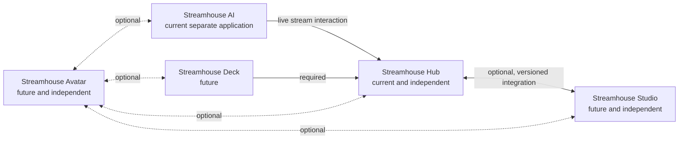

# Streamhouse product family

> Canonical source of truth for product-facing names, responsibilities,
> dependencies, product status, and branding.
>
> Everything for your stream under one roof.

## Brand and naming

**Streamhouse** is the umbrella company brand and product ecosystem. It is not
the name of one required application. Products in the family may work together,
but only dependencies explicitly documented here are required.

**Sally** is the default AI personality inside Streamhouse AI. Sally remains a
character in prompts, replies, commands, and viewer-facing features; Sally is
not the name of the complete Streamhouse ecosystem.

The implementation, packages, executables, local protocol, and GitHub
repository (`itsjusty0gurt/StreamHouse`) use Streamhouse product names. Active
internal generic infrastructure no longer uses SallyBot-era names. The hosted
relay retains a narrowly isolated external compatibility contract until the
deployment runbook's removal gates are met. All other current Sally names refer
to the AI personality/character or another deliberately Sally-specific concept.

## Product status

| Product | Status | Dependency rule |
| --- | --- | --- |
| Streamhouse Hub | Current | Independent |
| Streamhouse Studio | Future product; not implemented | Independent; optional Hub integration |
| Streamhouse AI | Current | Separately installable; live stream interaction goes through Hub |
| Streamhouse Deck | Future product; not implemented | Requires Hub |
| Streamhouse Avatar | Future product; not implemented | Independent; all integrations optional |

## Streamhouse Hub

> Manage and automate your stream.

Streamhouse Hub is the current main desktop application.

Hub owns the following product areas. This boundary includes planned
capabilities and is not a claim that every feature is implemented:

- Twitch integration
- OBS and future broadcaster integration
- chat and moderation
- commands
- counters and per-viewer counter values
- triggers, routines, tasks, queues, and variables
- stream information
- stream sessions and analytics
- soundboard
- channel points
- polls, predictions, and raids
- stream health
- remote-control routing

Hub must work independently. It must not require Streamhouse Studio,
Streamhouse AI, Streamhouse Avatar, or Streamhouse Deck.

Hub variables use provider-owned dotted namespaces such as `stream.*`,
`chat.*`, contextual `command.*` and `keyword.*`, global/contextual `ads.*`,
`counter.<stable_id>.stream`, `counter.<stable_id>.viewer`, `obs.*`, and
`custom.*`. Routine-scoped outputs use `automation.*`. `VariableRegistry`
and typed output definitions are Hub's sole metadata and resolution contract;
the pre-alpha flat catalog, parser, validation, and compatibility aliases have
been removed. Private development routines using them must be reset. These
are Hub automation infrastructure, and Streamhouse AI does not read Hub's
variable or counter files.

Implementation mapping:

| Concept | Current value |
| --- | --- |
| Product name | Streamhouse Hub |
| Executable/build name | `StreamhouseHub.exe` |
| Entry point | `products/hub/hub_main.py` |
| Implementation path | `products/hub/streamhouse_hub/` |

### Planned Your Channel workspace

The intended future structure of Hub's **Your Channel** workspace is:

- Overview
- Stream Info
- Chat
- Analytics
- Engagement
  - Polls
  - Predictions
- Raids
- Moderation
- Soundboard
- Commands
- Channel Points
- Counters
- User details / moderation

Analytics includes stream-session history and aggregate reporting; Stream
Sessions is not a separate workspace. This is a plan, not a statement that
every tab or control is implemented. Stream Health remains separate from
Moderation: health reports connection and service conditions, while Moderation
is for channel and viewer moderation.

The planned **Stream Info** experience should prefer native Streamhouse
controls backed by documented Twitch APIs. Candidate native fields include:

- Title
- Category
- Tags
- Language
- Content classification labels
- Branded-content status

OBS's Stream Info dock embeds Twitch's own web dashboard rather than natively
implementing every field. Hub should not copy that dependency model. Advanced
settings that are not supported by documented Twitch APIs may open Twitch's
dashboard; Hub should avoid undocumented Twitch dashboard requests.

Planned overview and dashboard items include stream uptime, follower count,
estimated hours watched, and a stream health summary. Any hours-watched value
derived locally from sampled viewer counts must be labeled as an estimate, not
official Twitch analytics.

Polls and Predictions belong under **Engagement**. Manual controls and
automation should eventually use the same Twitch service and the same
routine/task architecture. Potential future task types are:

- `twitch.create_poll`
- `twitch.end_poll`
- `twitch.create_prediction`
- `twitch.lock_prediction`
- `twitch.resolve_prediction`
- `twitch.cancel_prediction`

These task types are planned and are not currently registered with a task
provider.

Raid controls and events distinguish:

- **Raid Initiated**: Hub successfully starts the Twitch raid countdown.
- **Outgoing Raid Sent**: Twitch confirms that the outgoing raid occurred.
- **Incoming Raid**: another broadcaster raids the channel.

Incoming Raid and Outgoing Raid Sent observation are implemented through the
two official `channel.raid` conditions. Outgoing raid controls and a locally
confirmed Raid Initiated action remain planned; Twitch exposes no separate
raid-completed EventSub event.

Stream Health may summarize:

- Twitch authentication
- EventSub health
- missing scopes
- OBS or broadcaster connection
- broadcast state
- Streamhouse AI availability
- relay status
- recent API failures

Future Hub capabilities should continue using the established architectural
vocabulary: **Service**, **Trigger definition**, **Trigger event**, **Routine**,
**Task definition**, **Task provider**, and **Queue**. Integrations should use
services, normalized events, registered task providers, and versioned APIs
rather than direct special-case calls between unrelated UI pages. Plugins
remain a late-stage capability after these contracts are stable.

## Streamhouse Studio

> Create and broadcast your stream.

Streamhouse Studio is a possible future broadcasting and production
application. It is not implemented in this repository.

Possible responsibilities include:

- scenes
- sources
- audio mixing
- filters
- transitions
- recording
- encoding
- streaming output
- broadcast statistics

Studio and Hub must be peer applications:

- Hub works without Studio.
- Studio works without Hub.
- They should integrate when both are installed.
- Neither may become a required dependency of the other.
- Integration should use a documented, versioned local API or normalized
  service events.
- Hub remains compatible with OBS and other broadcasting software.
- Studio remains useful without Hub.

## Streamhouse AI

> Intelligence and personality for your stream.
>
> Featuring Sally, your local AI stream companion.

Streamhouse AI is the optional local AI application. Sally is its default
personality rather than the name of the complete software ecosystem.

Streamhouse AI owns:

- local model providers such as Ollama
- reply reasoning
- personality
- memory extraction
- AI training-data review
- AI testing and reports
- future voice, intent learning, and deeper reasoning

Streamhouse AI remains a separately installable application. It does not own
Twitch sockets, OBS control, automation execution, or final permission to
perform stream actions. Live Twitch and automation actions continue to pass
through Streamhouse Hub.

Implementation mapping:

| Concept | Current value |
| --- | --- |
| Product name | Streamhouse AI |
| Executable/build name | `StreamhouseAI.exe` |
| Entry point | `products/ai/ai_main.py` |
| Implementation paths | `products/ai/streamhouse_ai/` and `products/ai/engine/` |

## Streamhouse Deck

> Control your stream from anywhere.

Streamhouse Deck is a future mobile or browser-based remote-control product. It
is not implemented in this repository.

Deck requires Streamhouse Hub because Hub owns routines, connected services,
authorization, and action execution. Planned owner-authenticated controls may
include:

- routine buttons
- scene switching
- source and microphone controls
- soundboard controls
- poll and prediction controls
- raid controls
- live status indicators

Deck must use a stronger owner-authentication model than the public Twitch
Extension. The existing viewer soundboard Extension security model is not
sufficient for private broadcaster controls.

## Streamhouse Avatar

> Bring yourself—or your AI—to life.

Streamhouse Avatar is a future VTuber/avatar application. It is not implemented
in this repository.

Avatar should support both:

1. a streamer controlling their own avatar; and
2. Streamhouse AI controlling an AI character such as Sally.

Possible responsibilities include:

- PNGTuber-style avatars
- Live2D support
- 3D avatar support
- webcam or device-based tracking
- microphone-driven mouth movement
- expressions and gestures
- transparent broadcast output
- AI-driven emotion and animation cues

Avatar must be capable of working independently. Integrations with Hub, Studio,
AI, and Deck are all optional.

## Dependency diagram

The arrows describe integration dependencies, not installation bundles. Hub
does not depend on Studio, Studio does not depend on Hub, and Avatar remains
independent despite its optional links.
